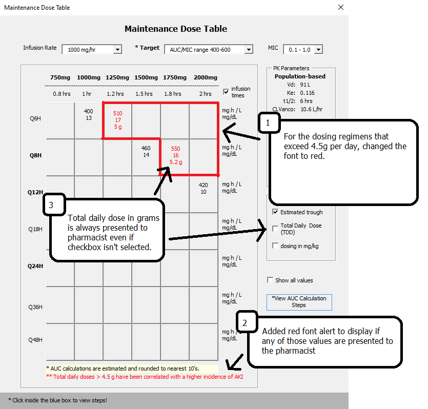
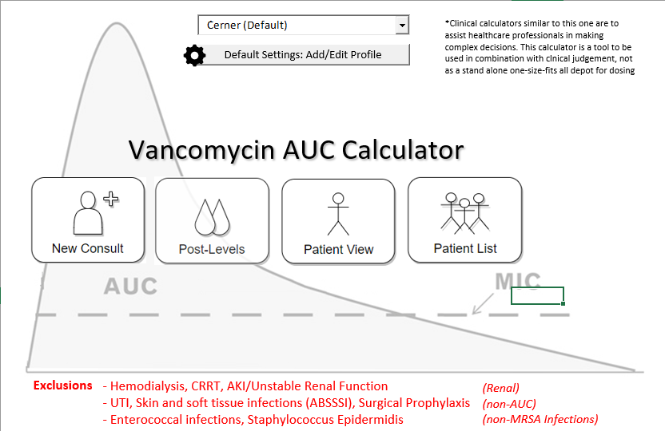
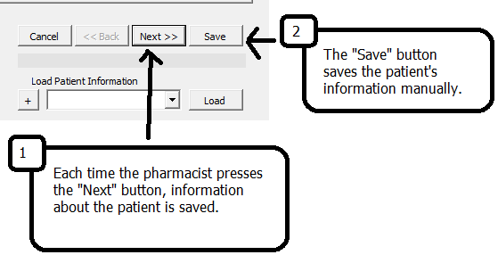

Hi Anya and team,

#### Question 1: 
	"Prevent any maintenance doses > 4500 mg/day from showing as options on the maintenance dose table?"

- For the doses greater than 4500 mg/day, I had been thinking about ways to cue the user that 4.5g/day was a threshold.  It looks like there are 6 possible dosing regimens that could be selected that pass that threshold.

- I'm not sure if it should be a `hard stop` vs. a `soft stop`.  For a hard stop, the pharmacist would not be able to select a regimen > 4.5g/day.  I was thinking there may be valid cases where that type of regimen is the appropriate regimen, so I was trying to figure out a soft stop way. 

Thoughts

1. Changed font of regimens > 4.5g/day to red instead of the normal black color.
2. Alert in red becomes visible when a dose that is greater than 4.5 g/day is presented to the pharmacist in the maintenance dose table.
3. Total daily dose in grams is always presented to pharmacist even if checkbox isn't selected.

#### Question 2:
	"Add Skin and soft tissue infections (ABSSSI), Enterococcal infections, Staphylococcus Epidermidis infections, 
	surgical prophylaxis to the exclusions on the landing page?"

- Updated Landing Page

#### Question 3:
	"I wanted to clarify, we should the user hit “save”.  Will the calculator intermittently save the information without “saving”?"

1. Each time the pharmacist presses the "Next" button, information about the patient is written into the database.
2. The "Save" button manually saves the patient information.

