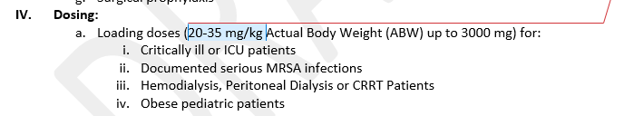
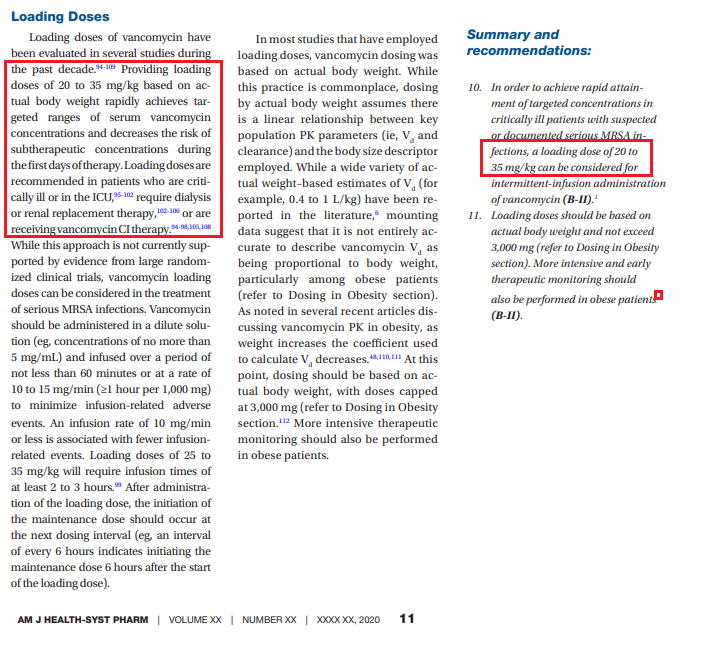
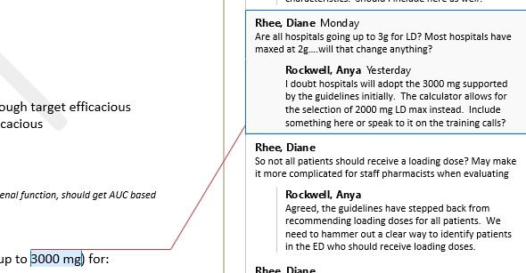
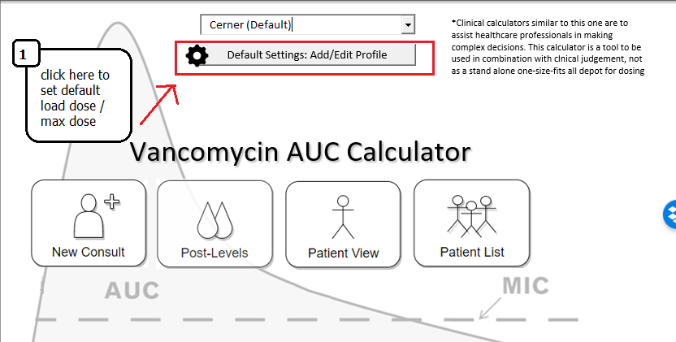
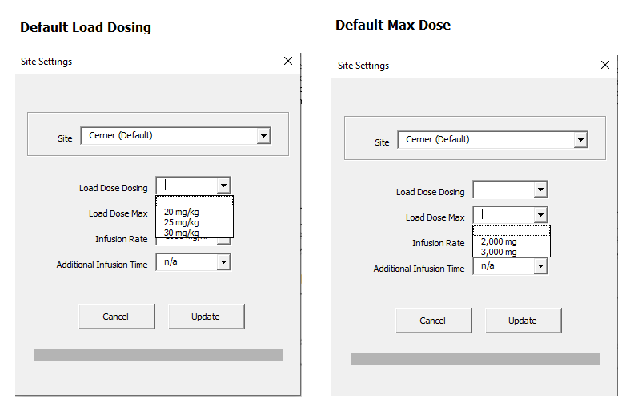
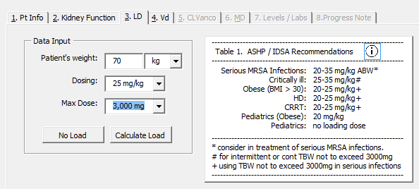
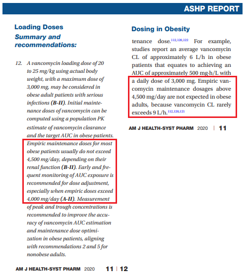
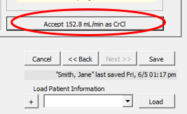
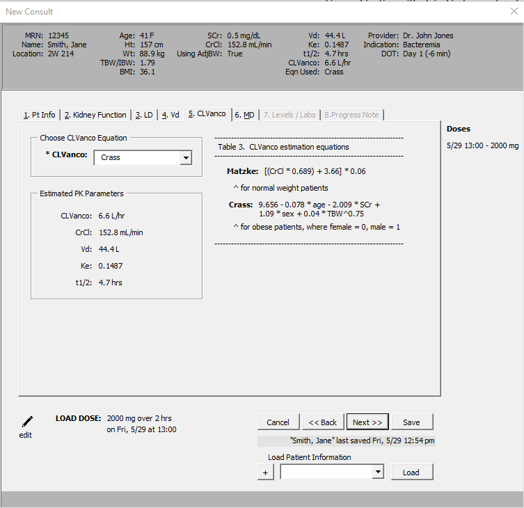
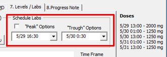

#### Section 1: Load Dosing

	

#### Guidelines

#### Section 2: Max Dose

#### Calculator

#### Setting default load dose or max dose

#### Load dose screen in calculator

#### Section 3: Capping doses at 4,500mg/day

	Does the dosing calculator max out at 4500mg/day?
	Or will the staff pharmacist have to remember this?

##### Background

##### Section 4: Inputting patient information into calculator

	Will this information pre-populate into the calculator or 
	will pharmacist have to enter it? I would suggest going 
	detailed step by step here as you did below since we will 
	send this out to everyone and they will not be on our initial 
	pilot calls to walk through the calculator – i.e.
		1.	Choose the New Consult button
		2.	Enter the patient information into the calculator and choose 
			Next (or Save) – does it automatically save the information or 
			should they Save and then choose Next? 
		3.	Etc.

- "Accept" buttons will also save patient information.  Label below information will alert user when the last time the patient's information was saved.

#### Section 5: Vancomycin Clearance Population Estimation

	"Would give some information about what clearance information 
	this is giving and whether the staff pharmacist has to do 
	anything on this section"

- Ok, will work on that!

#### Section 6: Levels / Labs

	Does the pharmacist put these levels in? or does the calculator automatically 
	pull these up depending on what time the loading dose or maintenance dose was given?

	- They can select the time of the levels from a drop down list – post 1 dose or post 4,5,6 dose

	Too much room for error – is there any way to make this more black and white? 
