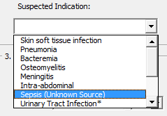
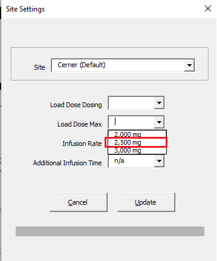
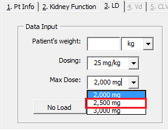
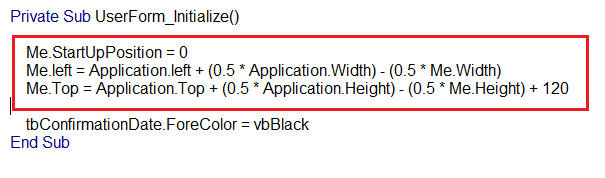

#### 06/17 Follow-up

Hi all!  

Here is a follow-up from today's meeting. Random, but I'm embarrased by some of the praise received at the meeting. =| 

Any questions or features, feel free to reach out to my email at [kpessa@gmail.com](mailto:kpessa@gmail.com "kpessa@gmail.com").  

Regards and thanks!
Kurt

##Updates

1. Add **Sepsis (Unknown Source)** to indications list
	* Pharmacist is able to free-write any indication into this field, but indications already listed will autocomplete when typing.
	

1. Add **"2,500 mg"** to max dose list
	- Added to Site Settings
	
	- Added to New Consult
	

2. Check to see if **BMI >= 30** is indeed indicator for choosing Crass
	* 30 is the cutoff used to select Crass instead of Matzke when selecting a vancomycin clearance population estimation equation.
	` If NewConsult.MultiPage.value = pg5_CLVanco And Not pt.char.BMI < 30 Then NewConsult.cmbCLVanco = "Crass"`

3. Date/Time Picker on same monitor
	* Updated Date/Time Picker to load on same monitor as calculator
	

## Working on for next week

4. Adding current AUC to Post-Levels on Page 3. Vd
	
5. Adding Transfer to DMC to New Consult userform
