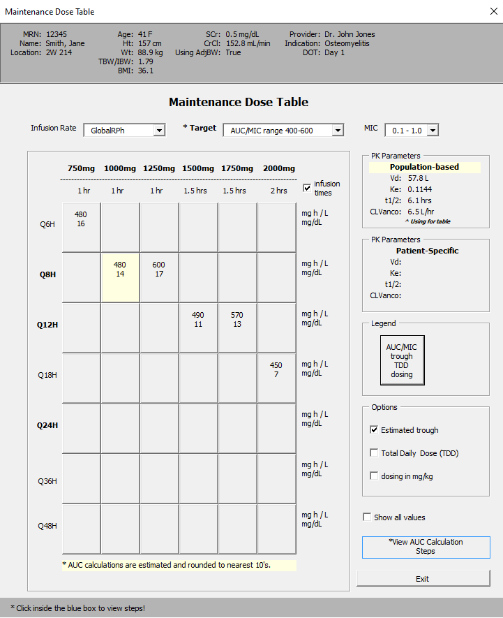
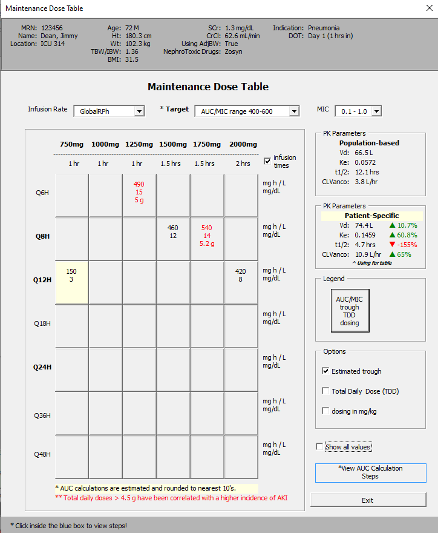
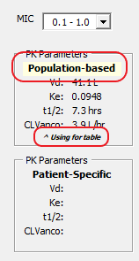

#6/23 Follow-up

##Tasks
&#9745; Denote maintenace dose in **`Post Levels`** maintenance dose table
&#9745; Change trough to AUC in monitoring form
&#9744; Add "Transfer to DMC Calculator" for `New Consult` userform **=/**

##Updates
1. Overview MDTable for **`New Consult`**.

2. Overview MDTable for **`Post Levels`**.

Changes

1. Added patient context to top of userform

<summary)2. Separated PK parameters into two frames

- highlighted the pk parameters, population-based or patient-specific that are being used for the table
- added label saying ***^ using for table***

 