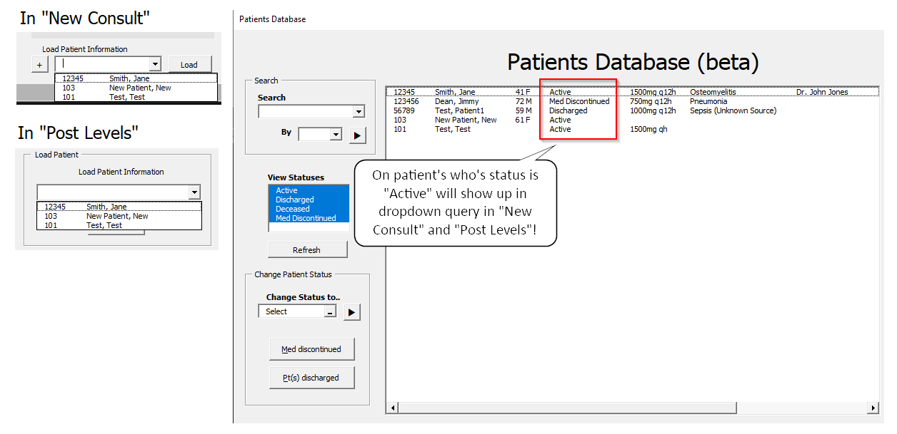
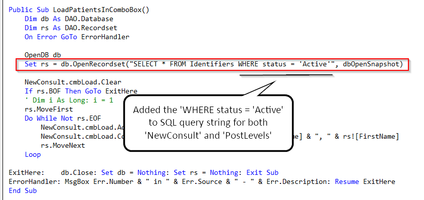
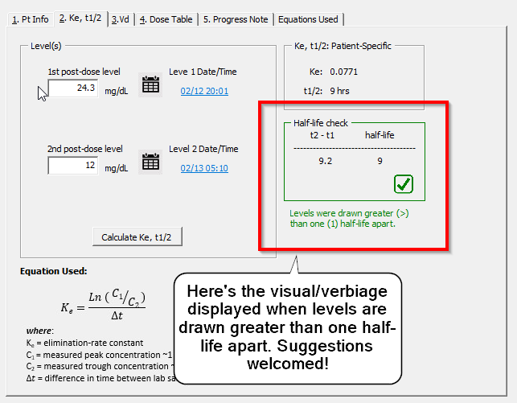
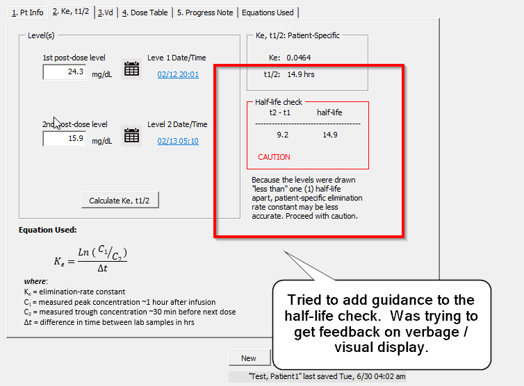

# 7/1 Follow-Up

## Next Steps

`PatientList`

☐ Day of therapy / Timeout to Patient List
☐ Add "Open in `NewConsult`/ `PostLevels`" functionality to `PatientList userframe`. 

* I've added the buttons, but have not connected them yet ...

User Guide` 

☐ Edit guide to update information

---
## Completed

`PatientList`

&#x2611; Patient discharged/deceased

- Added `Deceased` to option in patient statuses

**Multiple**
 &#x2611; Admitted/Active - keyword for active patients.  

- Decided on `Active` status because I felt like it made sense when using that status as `Active` when only selecting those values in dropdowns for `NewConsult` and `PostLevels`

  &#x2611;Adding "Where" clause in SQL string to select only active patients in Load button

* Added `where status = 'Active'` to SQL string in `cmbLoad` combobox dropdowns in `NewConsult` and `PostLevels`

  

`PostLevels`
&#x2611;   `PostLevels` page 3 - Guidance on half-life check 

#####  An example where levels drawn greater than one (1) half-life apart

#####  

##### An example where levels were drawn too close together

#### 

`uf_MDTable`
&#x2611; Arrows on maintenance dose table allowing pharmacist to switch between population-based parameters and patient specific parameters.

