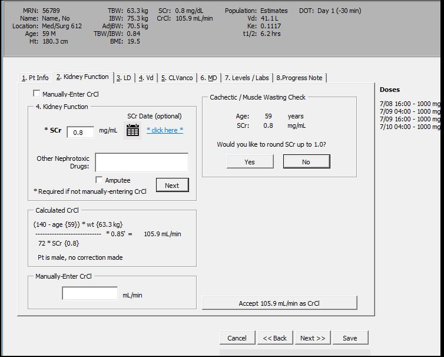
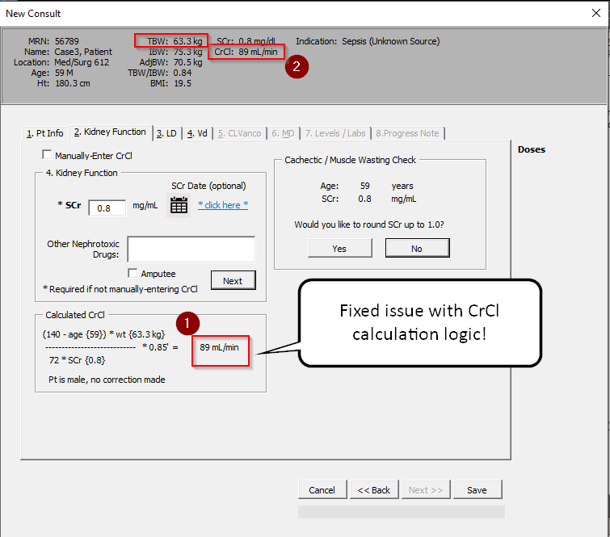

### 7/9 Follow-up - Fix to CrCl calculation logic

###### Faulty CrCl calculation logic

**From Lynsee:**

> I thought the Creatinine clearance calc was working but I found an issue.
>
> We were going through another of the test patients – Pat 3 has TBW<IBW. So it should use ABW to calculate and it looks it would be doing that via the equation. But if you actually calculate that out, it comes to 89ml/min, the 105.9ml/min results if you use the 75.3kg IBW number. Thanks again!!
>
> 


**Here's a screenshot from the updated calculator:**




### Problem

- It looks like I had had a `>` *greater than* instead of a `<` *less than*.  

### Fix

- Just switched the `>` *greater than* to `<` *less than* sign.  

>


**Here's the updated code in the calculator**:

```visual basic
' ---------------------------------------------------------------------------
' Procedure Name: CrCl
' Purpose: Purpose of this function is to calculate Creatinine
'           Clearance based off of the CockCroft-Gault eqn
'
' Default:  - Manually-entered CrCl takes precedence
'           - If SCr = 0 or not defined, return nothing or 0
'			- Use IBW as default
'
' Conditionals      (1) If ABW or TBW is < IBW, use ABW or TBW
'           		(2) If Pharmacist chooses AdjBW, use AdjBW
'           		(3) If Pharmacist chooses RoundedUpScr, use 1 for SCr
' ---------------------------------------------------------------------------
Public Function CrCl() As Double
    If ManuallyEnteredQ Then
        CrCl = ManuallyEnteredCrCl
    Else
        If SCr = 0 Then
            CrCl = 0
        Else
            If pt.char.Weight < pt.char.IBW Then
                If RoundedUpSCr Then
                    If pt.char.Gender = "M" Then CrCl = (140 - pt.char.Age) * pt.char.Weight / (72) * 1
                    If pt.char.Gender = "F" Then CrCl = (140 - pt.char.Age) * pt.char.Weight / (72) * 0.85
                Else
                    If pt.char.Gender = "M" Then CrCl = (140 - pt.char.Age) * pt.char.Weight / (72 * SCr) * 1
                    If pt.char.Gender = "F" Then CrCl = (140 - pt.char.Age) * pt.char.Weight / (72 * SCr) * 0.85
                End If
            Else
                Select Case RoundedUpSCr
                Case False
                    Select Case UsedAdjBW
                    Case False
                        If pt.char.Gender = "M" Then CrCl = (140 - pt.char.Age) * pt.char.IBW / (72 * SCr) * 1
                        If pt.char.Gender = "F" Then CrCl = (140 - pt.char.Age) * pt.char.IBW / (72 * SCr) * 0.85
                    Case True
                        If pt.char.Gender = "M" Then CrCl = (140 - pt.char.Age) * pt.char.AdjBW / (72 * SCr) * 1
                        If pt.char.Gender = "F" Then CrCl = (140 - pt.char.Age) * pt.char.AdjBW / (72 * SCr) * 0.85
                    End Select
                Case True
                    Select Case UsedAdjBW
                    Case False
                        If pt.char.Gender = "M" Then CrCl = (140 - pt.char.Age) * pt.char.IBW / (72 * 1) * 1
                        If pt.char.Gender = "F" Then CrCl = (140 - pt.char.Age) * pt.char.IBW / (72 * 1) * 0.85
                    Case True
                        If pt.char.Gender = "M" Then CrCl = (140 - pt.char.Age) * pt.char.AdjBW / (72 * 1) * 1
                        If pt.char.Gender = "F" Then CrCl = (140 - pt.char.Age) * pt.char.AdjBW / (72 * 1) * 0.85
                    End Select
                End Select
            End If
        End If
    End If
End Function
```

