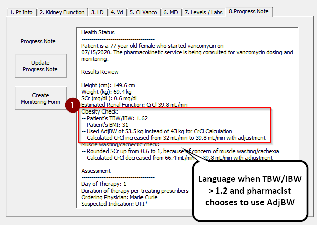
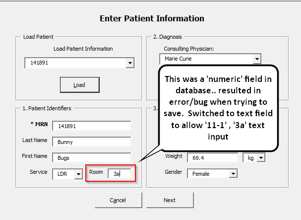
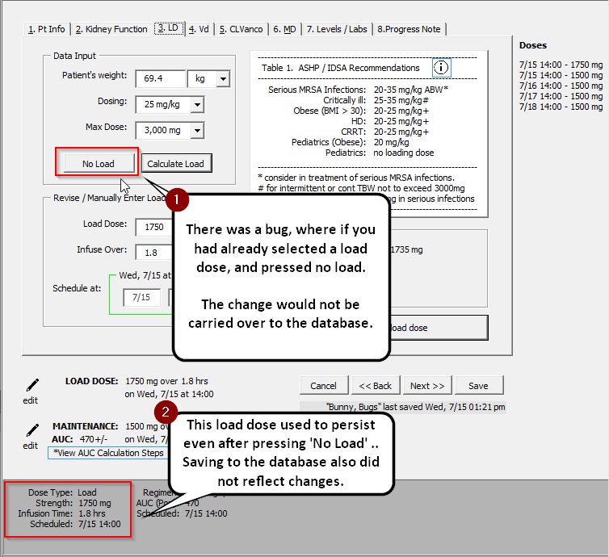
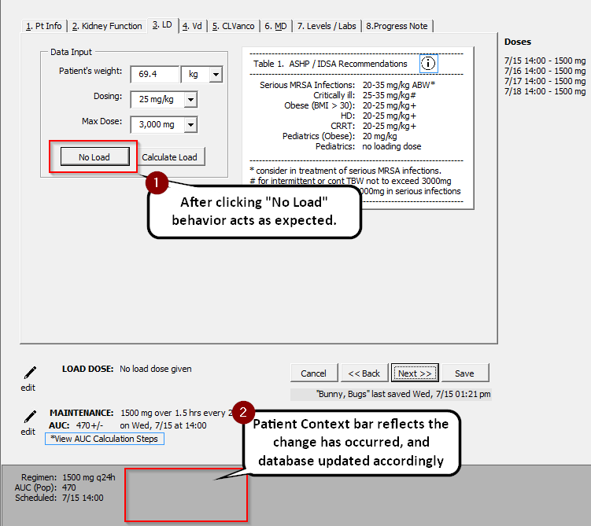

# 7/15 Follow-Up

## Updates

&#x2611; Updated `Progress note` in `NewConsult` userform to reflect changes with CrCl calculation

Bug Fixes - Details and screenshots below `Next Steps`

1. Switched numeric to text data type for Room property
2. Fixed 'No Load' behavior bug
3. Fixed bug where lab times were not being deleted from `PatientList` userform

## Next Steps

☐ `PostLevels`: Levels/Labs helper after inputting levels

☐ `PatientList`: Day of therapy / Timeout to Patient List

☐ `User Guide`: Edit guide to update information

&#9744; `NewConsult`:Add "Transfer to DMC Calculator" for `New Consult` userform 

-----------


###### Details and Screenshots of updates

&#x2611; Updated `Progress note` in `NewConsult` userform to reflect changes with CrCl calculation  

1. Actual Body Weight (ABW) < Ideal Body Weight (IBW) Example


**VBA Code**:

```visual basic
' TBW < IBW Check
    If pt.char.TBW < pt.char.IBW Then
        str = addLine(str, "Actual Body Weight (ABW) < Ideal Body Weight (IBW) Check:")
        str = addLine(str, "-- Patient's TBW/IBW: " & pt.char.TBW_IBWRounded)
        str = addLine(str, "-- Patient's BMI: " & pt.char.BMIRounded)
        str = addLine(str, "-- Patient's ABW: " & pt.char.TBWRoundedWithDescriptor)
        str = addLine(str, "-- Patient's IBW: " & pt.char.IBWRoundedWithDescriptor)
        str = addLine(str, "-- Used ABW of " & pt.char.TBWRoundedWithDescriptor & " instead of " & pt.char.IBWRoundedWithDescriptor & " for CrCl Calculation")
    End If
```


2. TBW/IBW > 1.2 and pharmacist chose to use AdjBW example

   

   **VBA Code:**

   ```visual basic
   ' Obesity Check
       If pt.kidney.UsedAdjBW Then
           str = addLine(str, "Obesity Check:")
           str = addLine(str, "-- Patient's TBW/IBW: " & pt.char.TBW_IBWRounded)
           str = addLine(str, "-- Patient's BMI: " & pt.char.BMIRounded)
           str = addLine(str, "-- Used AdjBW of " & pt.char.AdjBWRoundedWDescriptor & " instead of " & pt.char.IBWRoundedWithDescriptor & " for CrCl Calculation")
           pt.kidney.UsedAdjBW = False
           str = str & "-- Calculated CrCl increased from " & pt.kidney.CrClRoundedWithDescriptor
           pt.kidney.UsedAdjBW = True
           str = addLine(str, " to " & pt.kidney.CrClRoundedWithDescriptor & " with adjustment")
   End If
   ```


---------------

**Bug Fixes**

&#x2611; updated logic to update database field properties (bug fix for room variable switching from numeric to text type).



&#x2611; Updated bug where when you clicked "No Load" button, patient information about the load dose was not being updated and still displayed on context bar.





