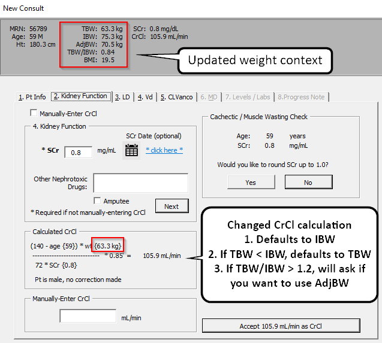

> Yeah I think it’s a good thing that you made that switch! The traditional Cockrault Gault is IBW unless you are obese and then its by adjusted bw. The default CrCl in CERNER says that too. Is it always by IBW now?? Or did we keep the adjusted bw?

<strong>I got it now so it defaults to IBW, if TBW < IBW, goes to TBW, and if TBW/IBW > 1.2, asks to adjust to AdjBW!</strong>

 

> I think the hardest part is just that when you add new code, it is hard to predict what other pieces of the puzzle that it might impact.

<strong>Yeah, that's how I've been feeling a good amount.  It feels like there's a lot of connected pieces, and when you change a part of the code, it may be mentioned 5 or 6 other places in the calculator!  </strong>

>  I lolled at Lynsee’s comment of “it used to work before” because I was like yes!! We’re piloting!! This is what happens and is quite normal when you are rolling out an app in the tech world anyways.

**I agree!**

>  Lol wasn’t it google that paid people to find security flaws? If only that could have been our year end bonus hahahaha.

<strong> Adrienne would so far be by far in the lead on finding flaws!  Big bonus!  hahaha!</strong>