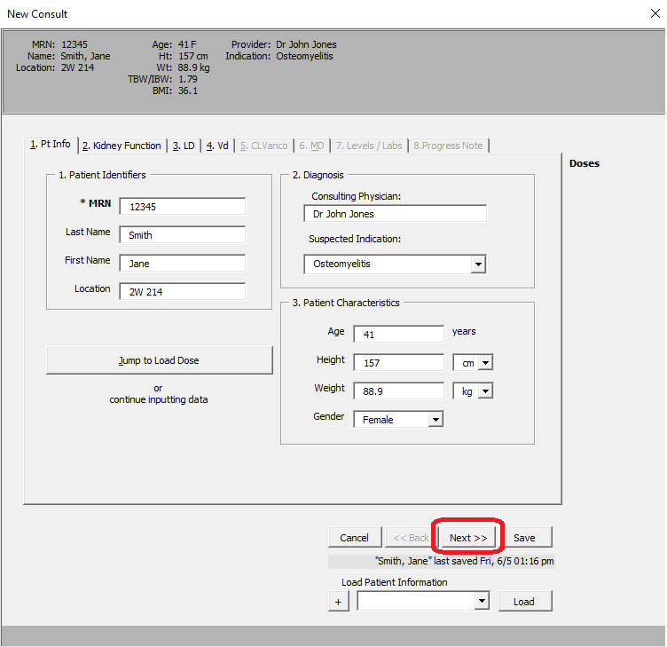
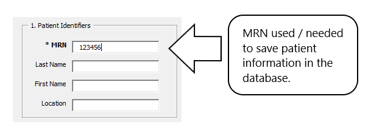
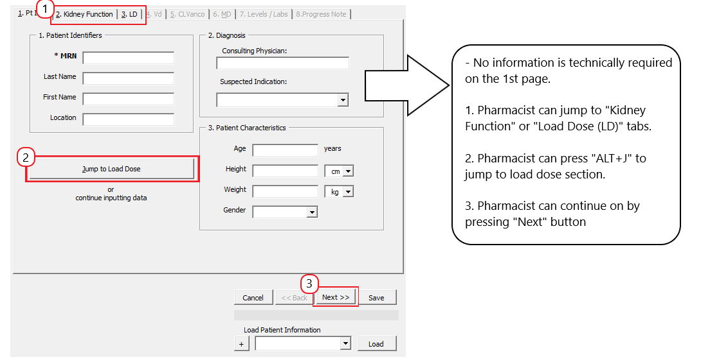
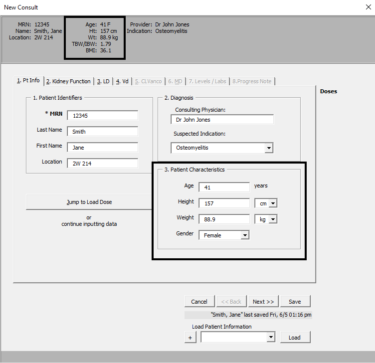
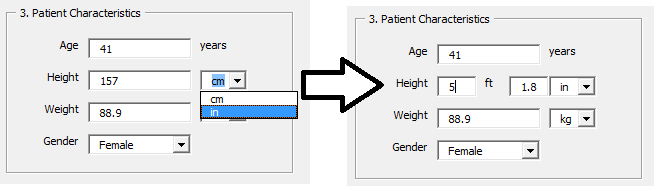
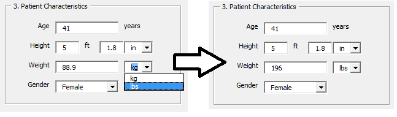

# Vancomycin AUC Calculator

# Table of Contents 
* [About The AUC24/MIC Calculator](#about) 
* [Pharmacist Vancomycin AUC24/MIC Workshop](#workshop)

- [Patient Example 1: **"New Consult"**](#ex1)
	1. [Patient Information](#ptinfo)
	2. [Kidney Function](#kidney)
	3. [Loading Dose (LD)](#ld)
	4. [Volume of Distribution (Vd)](#vd)
	5. [Vancomycin Clearance (CLVanco)](#clvanco)
	6. [Maintenance Dose Table (MD)](#md)
	7. [Levels / Labs](#labs)
	8. [Progress Note](#note)
	9. [Monitoring Form](#form)

#### About The AUC24/MIC Calculator 

This vancomycin calculator uses a variety of published pharmacokinetic equations and principles to estimate an initial vancomycin dosing regimen for a patient based on population estimates. Subsequently, a regimen may be calculated based two vancomycin levels for severe MRSA infections. The AUC24/MIC is calculated using the trapezoidal method.

**[&#129093; <ins>back to table of contents</ins>](#toc)**
# Pharmacist Vancomycin AUC24/MIC Workshop 
1. Patient example
2. Patient problems (2)
	- Empiric Dosing
	- 2 Levels with first dose
	- 2 Levels at steady state

**[&#129093; <ins>back to table of contents</ins>](#toc)**
## Patient Example 1: **"New Consult"** 
1. [Patient Information](#ptinfo)
	- [**Steps**](#ptinfosteps)
	- [** Comments: **](#ptinfocomments) 
		1. ***`MRN`*** used / needed to save patient information to database
		2. No info on first page technically required to proceed
		3. ***Anthropomorphics***: `TBW/IBW` and `BMI`
		4. ***Conversions***: for `Height` and `Weight`
2. [Kidney Function](#kidney)

**[&#129093; <ins>back to table of contents</ins>](#toc)**
### 1. Patient Information 
* 41 yo female with MRSA Osteomyelitis
* Wt: 88.9 kg
* Ht: 157 cm

##### Steps 

1. Choose the New Consult button
2. Enter the patient information into the calculator and choose Next. Choosing Next will save the information automatically.
3. Select save to add/update information in database 
4. Entering the medical record number will allow patient to be identified during future admissions in the database
5. Previously added patients can be identified and loaded in the “Load Patient Information” section

##### **Comments:** 
 

#### ***Anthropomorphics***: `TBW/IBW` and `BMI`
* If `Age`, `Height`, `Weight` and `Gender` are inputted, `TBW/IBW` and `BMI` are calculated and displayed in patient information ribbon.

#### Conversions: for `Height` and `Weight`

- For **`Height`**, can either input as ***`cm`s*** or ***`ft/in`s***

- For **`Weight`**, can either input as ***`kgs`*** or ***`lbs`***

**[&#129093; <ins>back to table of contents</ins>](#toc)**
### 2. Kidney Function 
* SCr: 0.5 (stable)
* no concurrent nephrotoxic drugs
* no amputations

##### Steps 
1. Manually-enter CrCl or enter `SCr`
	* If entering `SCr`, then press `Next` button

**[&#129093; <ins>back to table of contents</ins>](#toc)**
### 3. Loading Dose (LD) 
**[&#129093; <ins>back to table of contents</ins>](#toc)**
### 4. Volume of Distribution (Vd) 
**[&#129093; <ins>back to table of contents</ins>](#toc)**
### 5. Vancomycin Clearance (CLVanco) 
**[&#129093; <ins>back to table of contents</ins>](#toc)**
### 6. Maintenance Dose Table (MD)  
**[&#129093; <ins>back to table of contents</ins>](#toc)**
### 7. Levels / Labs 
**[&#129093; <ins>back to table of contents</ins>](#toc)**
### 8. Progress Note 
**[&#129093; <ins>back to table of contents</ins>](#toc)**
### 9. Monitoring Form 
**[&#129093; <ins>back to table of contents</ins>](#toc)**