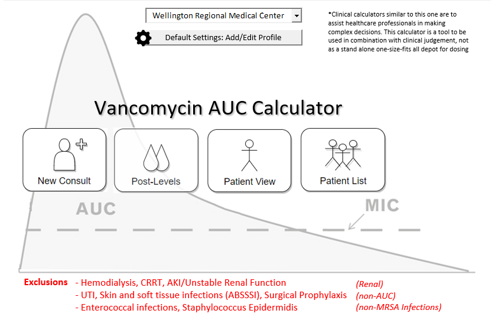

# Vancomycin AUC Calculator

## Table of Contents
1. [About The AUC24/MIC Calculator](#about) 
2. [Pharmacist Vancomycin AUC24/MIC Workshop](#workshop)

## About The AUC24/MIC Calculator 

This vancomycin calculator uses a variety of published pharmacokinetic equations and principles to estimate an initial vancomycin dosing regimen for a patient based on population estimates. Subsequently, a regimen may be calculated based two vancomycin levels for severe MRSA infections. The AUC24/MIC is calculated using the trapezoidal method.

## Pharmacist Vancomycin AUC24/MIC Workshop 
1. Patient example
2. Patient problems (2)
	a. Empiric Dosing
	b. 2 Levels with first dose
	c. 2 Levels at steady state

