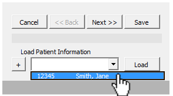

--------------
# 
Vancomycin AUC Calculator
 

> Most current excel file: &#9658; <ins>**[VancomycinCalculator.xlsm](https://github.com/kpessa/vanco-auc/raw/master/VancomycinCalculator.xlsm)**</ins> &#9668;

> Most current word doc: &#9658; <ins>**[AUC_MIC Vancomycin Dosing Update20200617.docx](https://github.com/kpessa/vanco-auc/raw/master/Vancomycin%20Dosing%20Handout/AUC_MIC%20Vancomycin%20Dosing%20Update20200617.docx)**</ins> &#9668;

> Most current powerpoint ppt: &#9658; <ins>**[Vancomycin Bulletins MD RN LAB.pptx](https://github.com/kpessa/vanco-auc/raw/master/Vancomycin%20Dosing%20Handout/Vancomycin%20Bulletins%20MD%20RN%20LAB.pptx)**</ins> &#9668;

--------------
# 
Table of Contents 

* [About The AUC24/MIC Calculator](#about) 
* [Pharmacist Vancomycin AUC24/MIC Workshop](#workshop)

- [Patient Example 1: **"New Consult"**](#ex1)
	1. [Patient Information](#ptinfo)
	2. [Kidney Function](#kidney)
	3. [Loading Dose (LD)](#ld)
	4. [Volume of Distribution (Vd)](#vd)
	5. [Vancomycin Clearance (CLVanco)](#clvanco)
	6. [Maintenance Dose Table (MD)](#md)
	7. [Levels / Labs](#labs)
	8. [Progress Note](#note)
	9. [Monitoring Form](#form)

[&#8592; previous section](#header) | [&#9650; back to header](#header) | [next section &#8594;](#about)

---

#### 
About The AUC24/MIC Calculator 

This vancomycin calculator uses a variety of published pharmacokinetic equations and principles to estimate an initial vancomycin dosing regimen for a patient based on population estimates. Subsequently, a regimen may be calculated based two vancomycin levels for severe MRSA infections. The AUC24/MIC is calculated using the trapezoidal method.

[&#8592; previous section](#toc) | [&#9650; back to table of contents](#toc) | [next section &#8594;](#workshop)

--------------
### 
Pharmacist Vancomycin AUC24/MIC Workshop 

1. Patient example
2. Patient problems (2)
	- Empiric Dosing
	- 2 Levels with first dose
	- 2 Levels at steady state

[&#8592; previous section](#about) | [&#9650; back to table of contents](#toc) | [next section &#8594;](#ex1)

--------------
### 
Patient Example 1: **"New Consult"** Summary

1. [Patient Information](#ptinfo)
	- [**Steps**](#ptinfosteps)
	- [** Further Reading: **](#furtherreading) 
		1. ***`MRN`*** used / needed to save patient information to database
		2. No info on first page technically required to proceed
		3. ***Anthropomorphics***: `TBW/IBW` and `BMI`
		4. ***Conversions***: for `Height` and `Weight`
2. [Kidney Function](#kidney)
3. [Loading Dose (LD)](#ld)
4. [Volume of Distribution (Vd)](#vd)
5. [Vancomycin Clearance (CLVanco)](#clvanco)
6. [Maintenance Dose Table (MD)](#md) 
7. [Levels / Labs](#labs)
8. [Progress Note](#note)
9. [Monitoring Form](#form)

[&#8592; previous section](#workshop) | [&#9650; back to table of contents](#toc) | [next section &#8594;](#ptinfo)

--------------
### 1. Patient Information 
* 41 yo female with MRSA Osteomyelitis
* Wt: 88.9 kg
* Ht: 157 cm 

----

##### Steps 

1. Choose the New Consult button

2. Enter the patient information into the calculator

3. Select "Next" button. Choosing Next will save the information automatically.

#### Further Reading 

1. MRN used / needed to save patient information to database 

 
#### **`MRN`** used / needed to save patient information to database

2. Previously added patients can be identified and loaded in the “Load Patient Information” section

3. No info on first page technically required to proceed 

4. Anthropomorphics: TBW/IBW and BMI 

#### ***Anthropomorphics***: `TBW/IBW` and `BMI`
* If `Age`, `Height`, `Weight` and `Gender` are inputted, `TBW/IBW` and `BMI` are calculated and displayed in patient information ribbon.

5. Conversions: for Height and Weight

#### Conversions: for `Height` and `Weight`

- For **`Height`**, can either input as ***`cm`s*** or ***`ft/in`s***

- For **`Weight`**, can either input as ***`kgs`*** or ***`lbs`***

[&#8592; previous section](#ex1) | [&#9650; back to example summary](#ex1) | [next section &#8594;](#ptinfocomments)

-------

### 2. Kidney Function 
* SCr: 0.5 (stable)
* no concurrent nephrotoxic drugs
* no amputations

-------

##### Steps 

1. Manually-enter CrCl or enter SCr

1. Manually-enter CrCl or enter `SCr`
* If entering `SCr`, then press `Next` button

	
2. If patient is muscle wasted or cachectic, the `SCr` can be rounded by selecting “Yes”
3. If patient is obese (>120% IBW) the `AdjBW` can be used to calculate CrCl by selecting “Yes”
4. Select “Accept ### ml/min as CrCl” 

**[&#9650; <ins>back to table of contents</ins>](#toc)**
### 3. Loading Dose (LD) 
**[&#9650; <ins>back to table of contents</ins>](#toc)**
### 4. Volume of Distribution (Vd) 
**[&#9650; <ins>back to table of contents</ins>](#toc)**
### 5. Vancomycin Clearance (CLVanco) 
**[&#9650; <ins>back to table of contents</ins>](#toc)**
### 6. Maintenance Dose Table (MD)  
**[&#9650; <ins>back to table of contents</ins>](#toc)**
### 7. Levels / Labs 
**[&#9650; <ins>back to table of contents</ins>](#toc)**
### 8. Progress Note 
**[&#9650; <ins>back to table of contents</ins>](#toc)**
### 9. Monitoring Form 
**[&#9650; <ins>back to table of contents</ins>](#toc)**