# 6/24 Follow-up

## Tasks
&#9745; Change trough to AUC in monitoring form
&#9745; Denote maintenace dose in **`Post Levels`** maintenance dose table
&#9744; Add "Transfer to DMC Calculator" for `New Consult` userform **=/**

## Update summary
**LINKS DON'T WORK IN PDF FORMAT =/**
1. [Updated Monitoring Form](#monitoring)
2. [Updated MDTable for **`New Consult`**](#mdtablenewconsult)
	- [Added patient context bar to the top of `maintenance table` userform](#ptcontext)
	- [Separated PK paramaters into two frames](#twoframes)
3. [Updated MDTable for **`Post Levels`**](#mdtablepostlevels)
	- [Added percent change, triangles with colors to denote significant changes > 5% from population-based PK parameters](#percentchange)
	- [Highlighted dosing regimen in maintenance dose table if patient already has a selected regimen](#highlight)
4. [Updated `Post Levels` Vd user experience](#postlevels_vd)
5. [Updated Post Levels height and height units events](#postlevels_height)

-----------

-----------

### 1. Updated Monitoring Form 

- Monitoring form now copies sheet from workbook and makes a new workbook (I'm trying to keep the actual excel file from containing any patient information)
	- Patient information will be stored in `db.accdb` database
	- Monitoring form with patient information will pop up with new workbook

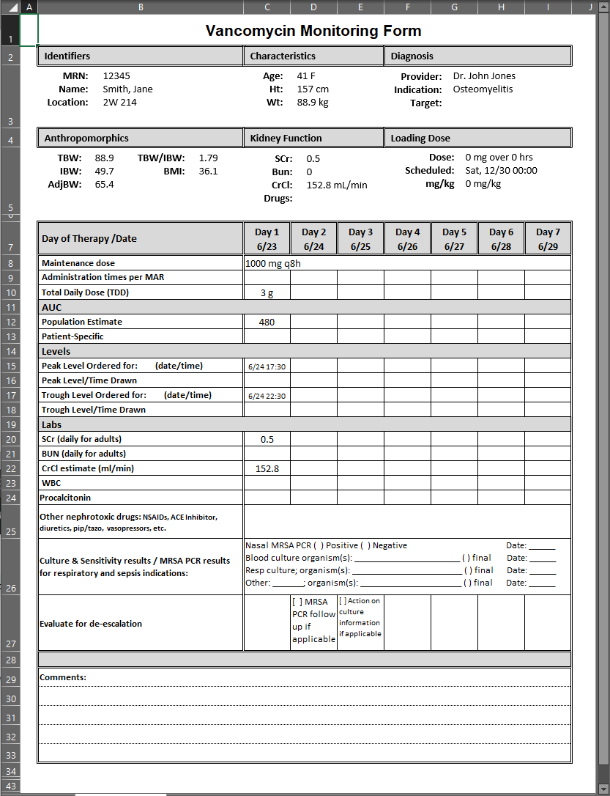

 - It still looks like it may need work, so any features, feedback, or design suggestions would be welcomed!

### 2. Overview MDTable for **`New Consult`**. 

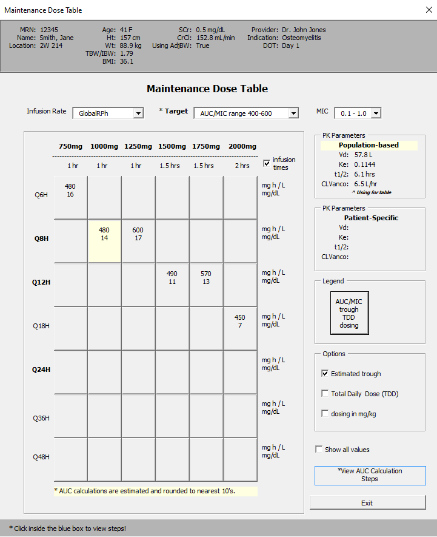

#### 2a. Added patient context to top of userform 

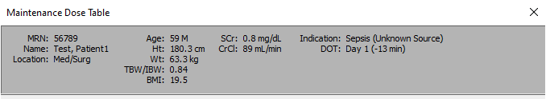

#### 2b. Separated PK parameters into two frames 

- highlighted the pk parameters, population-based or patient-specific that are being used for the table
- added label saying ***^ using for table***

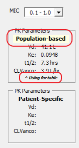

### 3. Overview MDTable for **`Post Levels`**. 

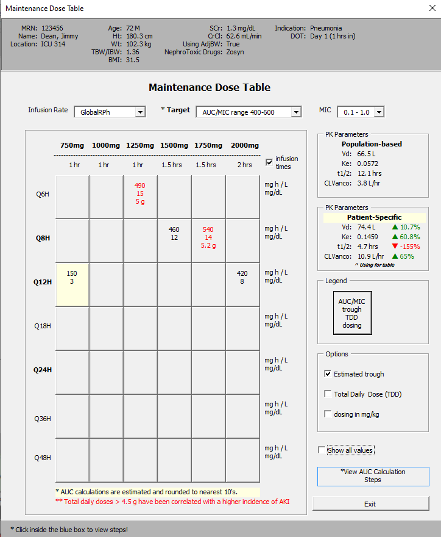

#### 3a. Added percent change, triangles with colors to denote significant changes > 5% from population-based PK parameters 

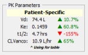 

#### 3b. If there is a `maintenance dose` or dosing regimen already selected, that option will be highlighted in dosing table 

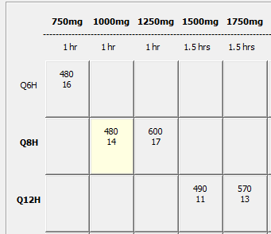

#### 4. Updated `Post Levels` user experience 

	Feedback:
	Is there a way to make the user pick 1st Dose versus Steady State or default to Steady State?
	I think I forget to go through and pick through that option and almost made a major med error
	today.

- Pharmacist is now greeted to an empty tab where you first have select which strategy you are using for dosing.

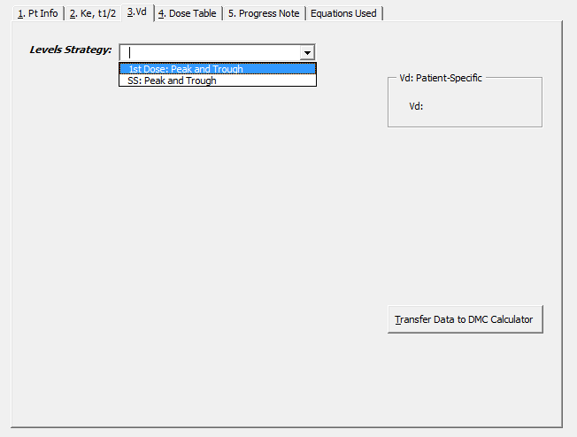

- After selecting, the relevant equation and information will be presented to the pharmacist.

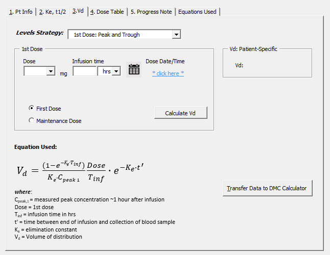

- Added an option radio buttons to designate if the`first dose` was a `Load Dose` or `Maintenance Dose`

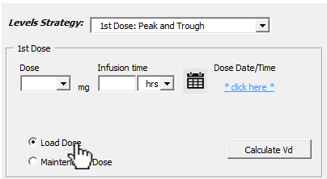

- Updates information about the patients doses accordingly

#### 5. Updated `Post Levels` height and height units events 

	Feedback:
	I think that the height isn’t being saved?  
	When I try to reload the patient, there’s a blank space on the height.

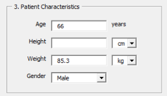

- When looking back at the code, I had a comment that I needed to rewrite the logic for that section of the calculator! =/

- Rewrote the two events for `Post Levels` section.
	

