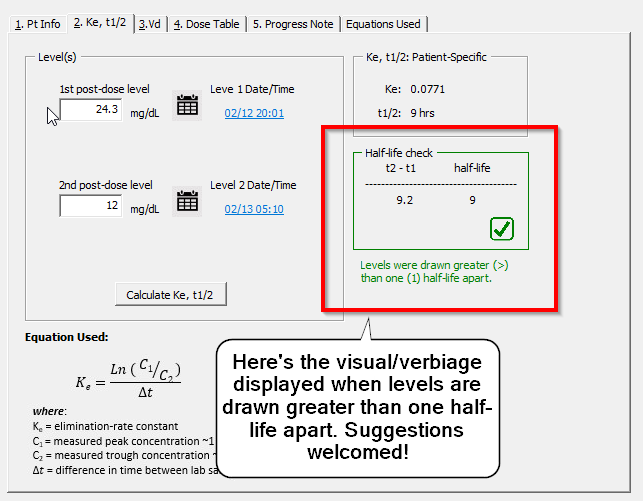
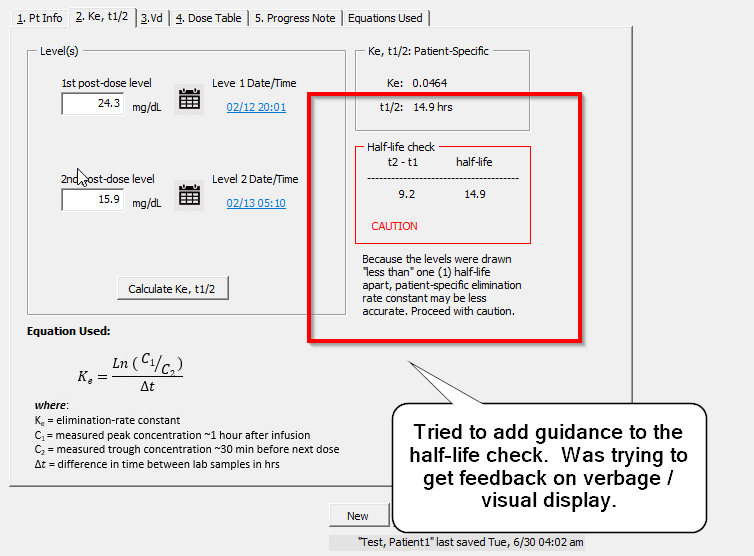

# 6/30 Follow-Up

## Action Items
---
`PostLevels`
&#x2611;   `PostLevels` page 3 - Guidance on half-life check 

#####  An example where levels drawn greater than one (1) half-life apart

#####  

##### An example where levels were drawn too close together

#### 

`uf_MDTable`
&#x2611; Arrows on maintenance dose table allowing pharmacist to switch between population-based parameters and patient specific parameters.

`PatientList`
☐ Patient discharged/deceased
☐ Day of therapy / Timeout to Patient List
☐ Add "Open in `NewConsult`/ `PostLevels`" functionality to `PatientList userframe`.  
**Multiple**
☐ Admitted/Active - keyword for active patients.  
  ☐ Adding "Where" clause in SQL string to select only active patients in Load button
`User Guide`

☐ Edit guide to update information
---