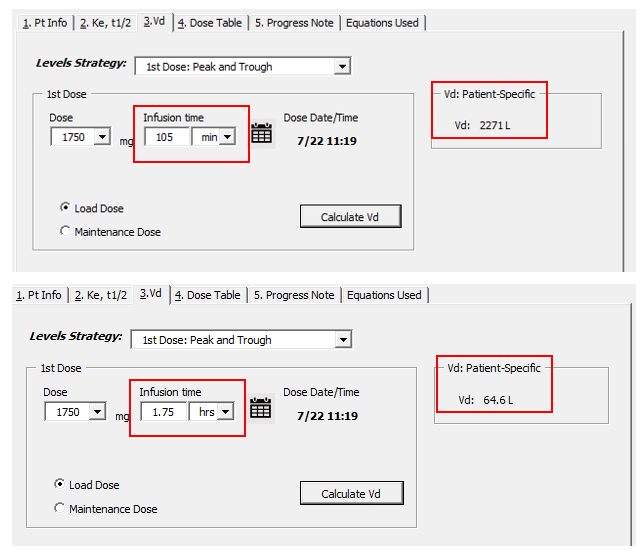
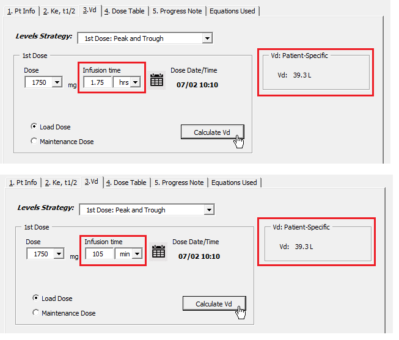
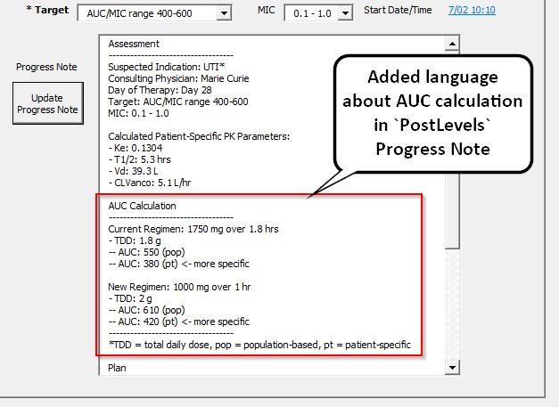
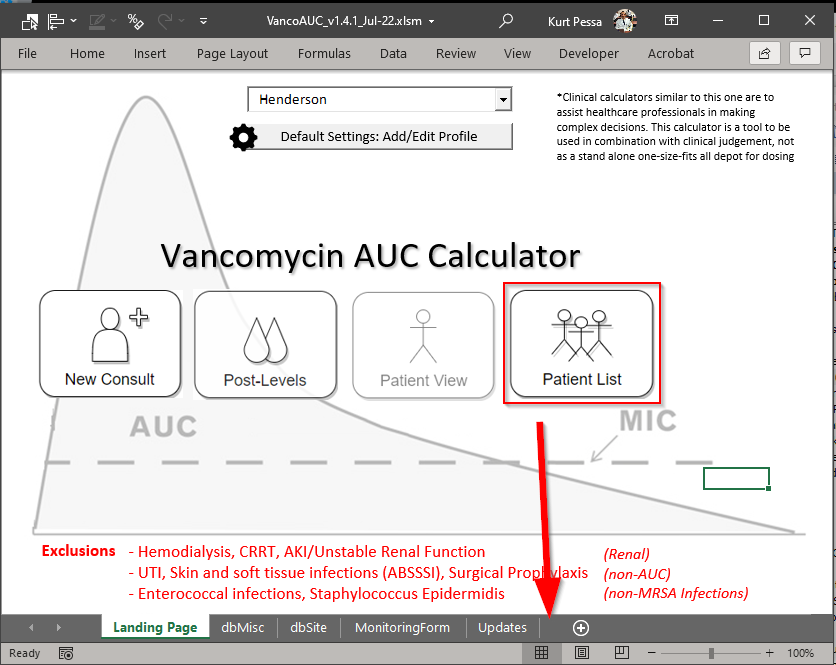
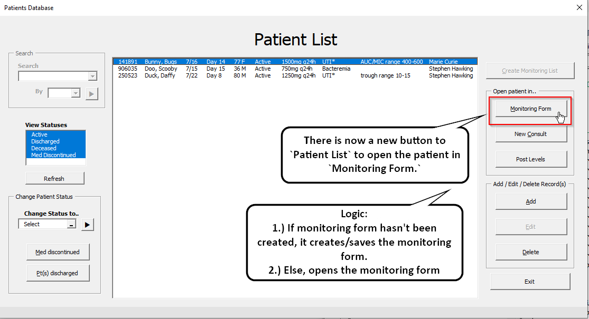
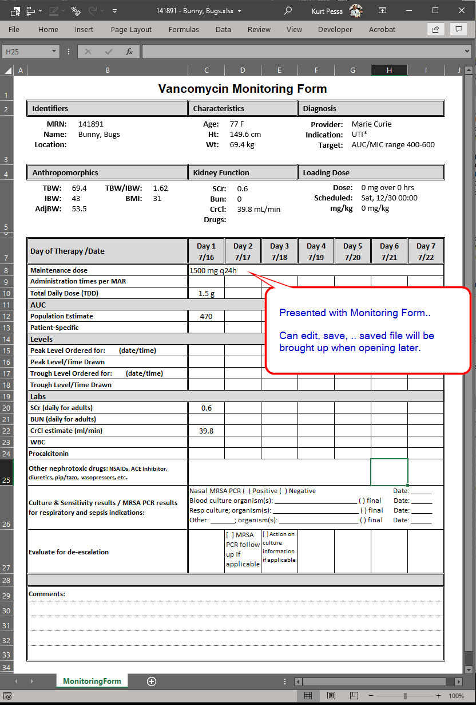
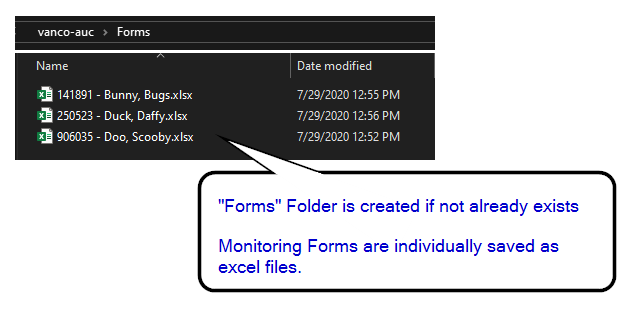

# 7/29 Follow-Up

## Updates

&#x2611; Addressed `hrs/min` bug with `PostLevels` Vd calculation.

&#x2611; Added Patient-Specific AUC to progress note in `PostLevels`.

&#x2611; Tried to incorporate "Monitoring Form" digitally into calculator.

## Next Steps

☐ `PostLevels`: Levels/Labs helper after inputting levels

☐ `PatientList`: Day of therapy / Timeout to Patient List - Need to add logic for Timeout (48-72 hrs?)

☐ `User Guide`: Edit guide to update information

&#9744; `NewConsult`:Add "Transfer to DMC Calculator" for `New Consult` userform 

-----------


###### Details and Screenshots of updates

#### 1.) Bug Fix with Vd calculation when ***minutes*** are selected

-------------------

> 1. Calculator does not calculate accurate **Vd** if infusion time changed to ***minutes***. 
>
>    If unable to convert minutes to hours in the equation, maybe we should remove minutes as an options?
>
>     Especially since Cerner default vancomycin infusion times (at least at Henderson) is minutes for 1.25gm and 1.75gm doses.  
>
>    Having the options may cause confusion and lead to inappropriate dose adjustments.

&#x2611; Addressed `hrs/min` bug with `PostLevels` Vd calculation.

**Before**: was treating minutes like hours for Vd calculation.



**After**:



**VBA Code**:

```visual basic
'Declare Tinf (or infusion time) into memory'
Dim Tinf As Double:

If PostLevels.cmbInfusionTimeUnits = "hrs" Then
    Tinf = CDbl(PostLevels.tbTinf)
'Convert infusion time to hours if dropdown is in "min"
ElseIf PostLevels.cmbInfusionTimeUnits = "min" Then
    Tinf = CDbl(PostLevels.tbTinf) / 60
End If
```

#### 2.) Added Patient-Specific AUC to progress note in `PostLevels`

&#x2611; Added Patient-Specific AUC to progress note in `PostLevels`.

--------------------

> 1. When entering post-dose levels...  Is it possible to add the calculated pt specific AUC for the current dose in the progress note? 
>
>    This way it shows why the dose is being either increased or decreased. 
>
>    Currently, it only provides the estimated new AUC based on the new vancomycin dose.



#### 3.) Tried to incorporate `Monitoring Form` into calculator with more accessibility

--------------------

&#x2611; Tried to incorporate "Monitoring Form" digitally into calculator.

1. When looking at the `Patient List`







