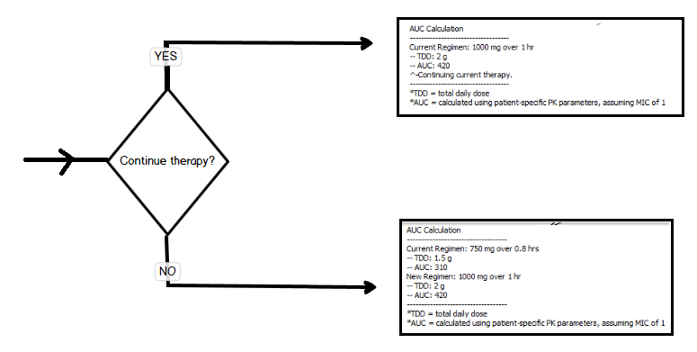
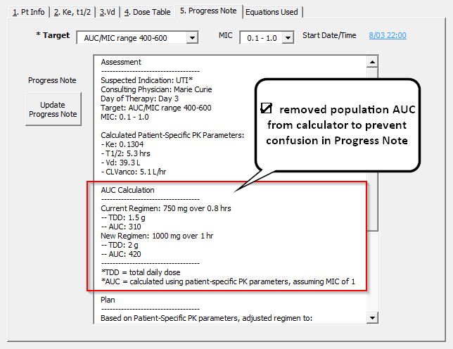
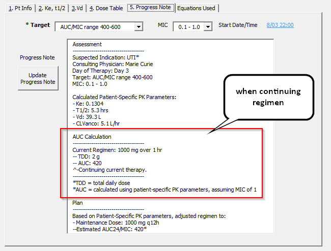

## Aug-5th Follow up
☑ Removed population AUC from calculator to prevent confusion in Progress Note.

Branch point:

1. **New Regimen**: What it looks like when a new regimen is selected.

2. **Continuing Regimen**: What it looks like when cotinuing a regimen.

> As always, I'm open to feedback on language used, style of what's defaulted!  

☑ Evaluated if monitoring form can automatically calculate CrCl
> I'm working on it!!  I don't have a deliverable for this week!

---
### Next Steps
Working on..
- ☐ `Monitoring Form`: Solution for combining Genevieve's monitoring form, functionality of calculated CrCl in monitoring form.  
---
Still thinking about ...

- ☐ `Modeless`: Try to keep userforms 'Modeless' so that pharmacist can navigate outside of userform

- ☐ `PostLevels`: Levels/Labs helper after inputting levels
- ☐ `PatientList`: Day of therapy / Timeout to Patient List - Need to add logic for Timeout (48-72 hrs?)
- ☐ `User Guide`: Edit guide to update information
- ☐ `NewConsult`: Add "Transfer to DMC Calculator" for `New Consult` userform 
