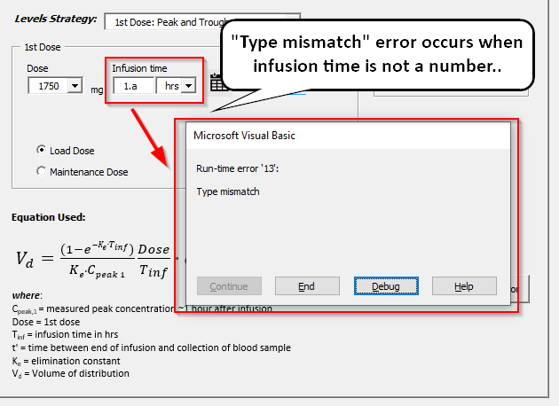
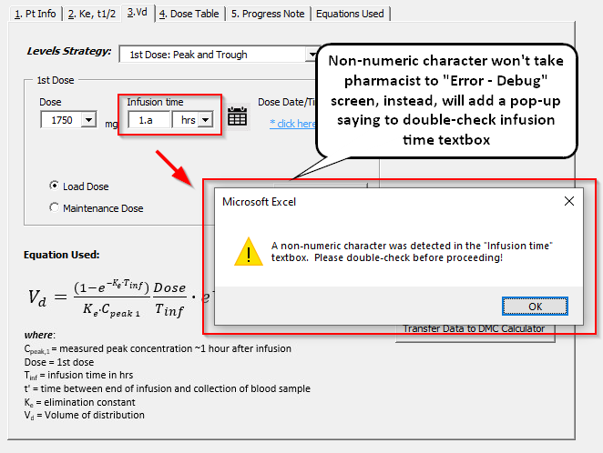
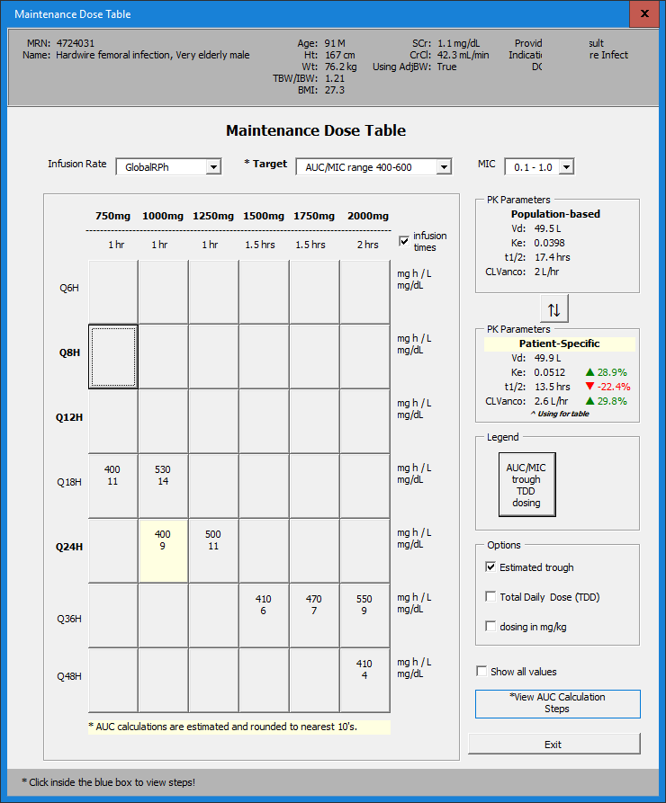
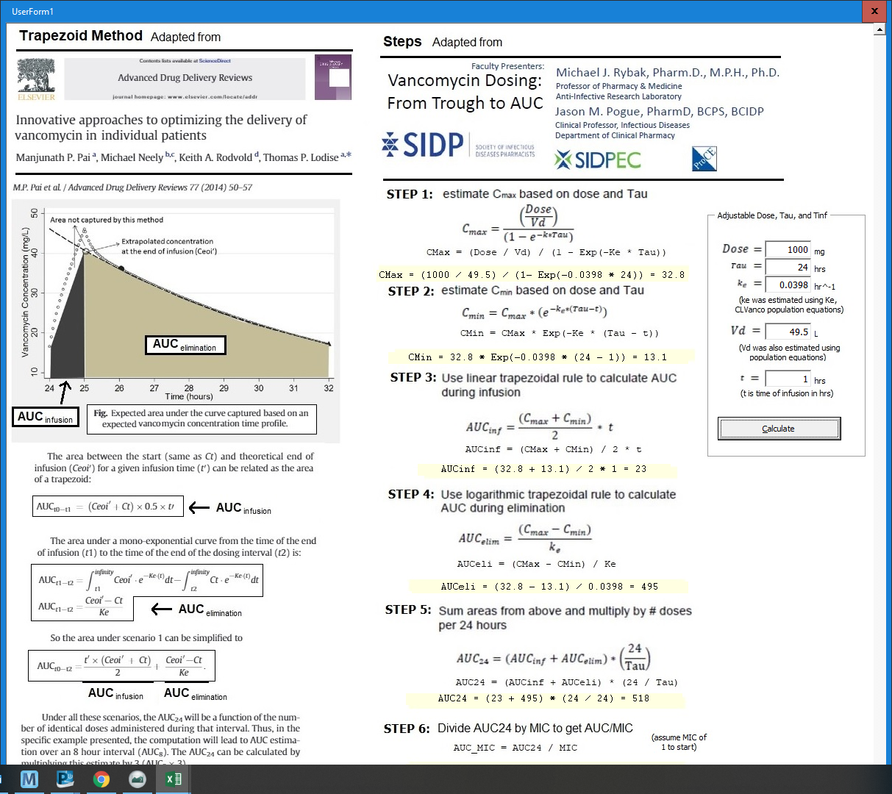
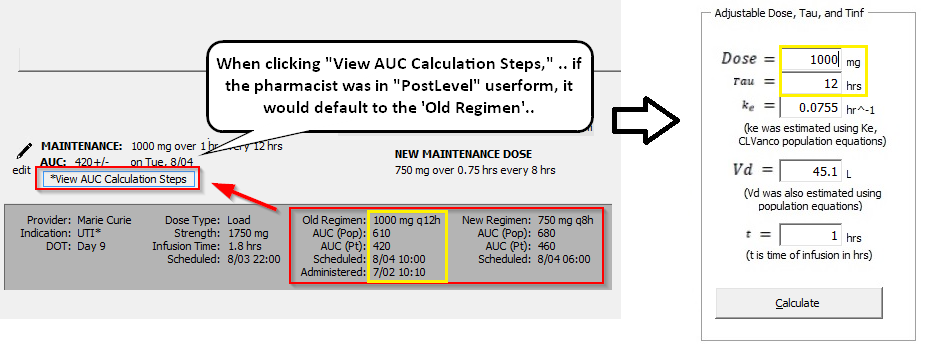
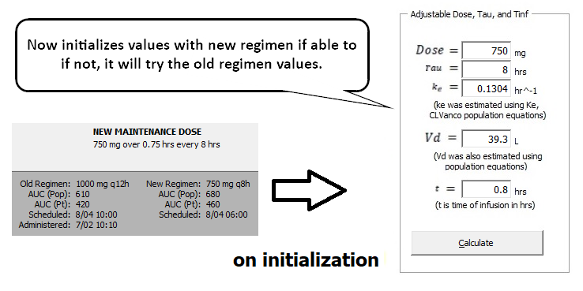

---
title = Aug-12th Follow up
author = Kurt P
---

[TOC]

# Aug-12th Follow up

## ☑ Error-handling in PostLevels / Infusion-time textbox 

☑ Handled error when pharmacist would enter non-numeric characters into infusion time textbox

### **Before**: "Type Mismatch" error



### **After:** Message Box with warning



## ☑ Bug in AUC Steps Initialization

### **Feedback**: Bug - Initializing AUC Steps Userform

> I realized that the AUC Calculations steps in the post-levels are not importing in the new patient-specific parameters, but copy over the population-based. Can we make the view AUC Caluclation steps default to patient specific in the post levels part??
>
> My vanc 1gm q24h says 400 here, but 518 on the AUC calculation steps??

**Screenshots**:



​	

### ☑ Revisited logic when initializing userform

- I checked the initialization code, and double-checked to make sure it was trying to get the pt-specific vs population-based in the post-levels section. 

  - There could have been an error about figuring out which userform it was on.  I updated that code, so I'm thinking the bug was fixed.

  ```vb
  If fmStr = "PostLevels" Then
      tbStepsKe = pt.pk_pt.KeRounded
      tbStepsVd = pt.pk_pt.VdRounded
  End If
  ```

  

- **Old logic**:

  

- **New Logic**:

  


☑ Evaluated if monitoring form can automatically calculate CrCl

> I'm working on it!!  I don't have a deliverable for this week!


---
# Next Steps
## Working on..

### ☐ `Monitoring Form`: Solution for combining Genevieve's monitoring form, functionality of calculated CrCl in monitoring form.  

---
## Still thinking about ...

### ☐ `Timeout`:  Deeper integration into `PatientList` userform

### ☐ `Modeless`: Try to keep userforms 'Modeless' so that pharmacist can navigate outside of userform

### ☐ `PostLevels`: Levels/Labs helper after inputting levels

### ☐ Graph: Thinking about including more labels / graphs in chart / include in `PostLevels` userform

### ☐ `PatientList`: Day of therapy / Timeout to Patient List - Need to add logic for Timeout (48-72 hrs?)

### ☐ `User Guide`: Edit guide to update information

### ☐ `NewConsult`: Add "Transfer to DMC Calculator" for `New Consult` userform 