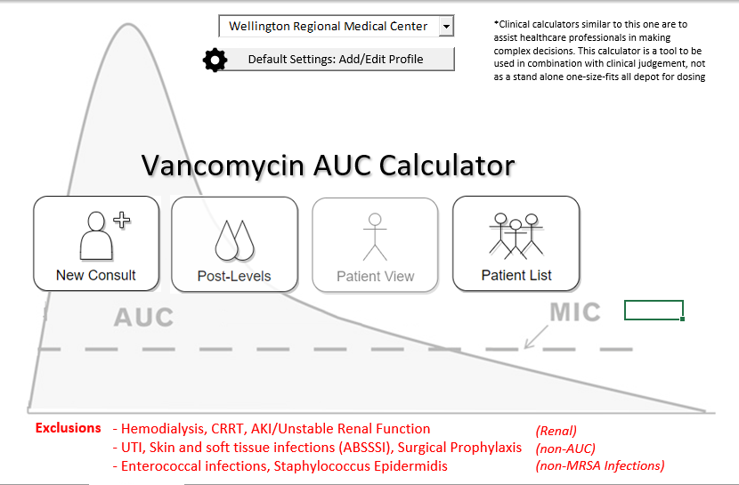
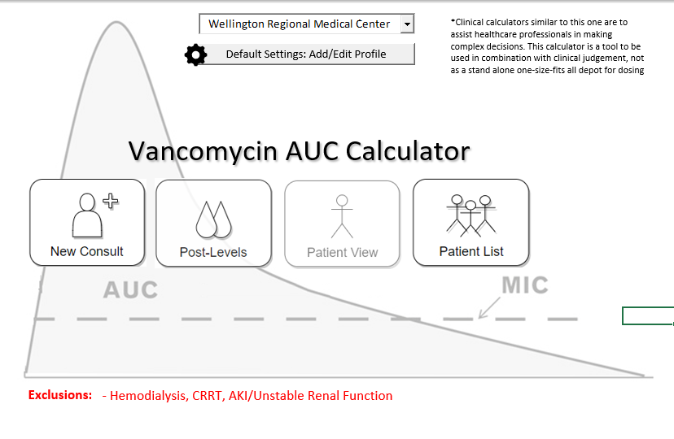
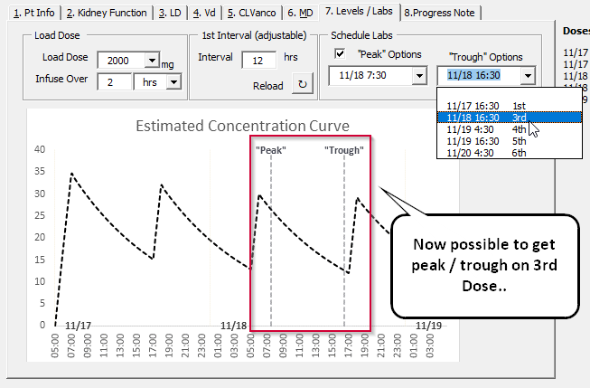
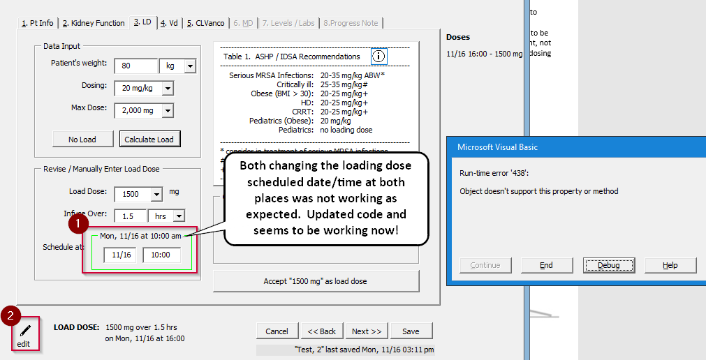
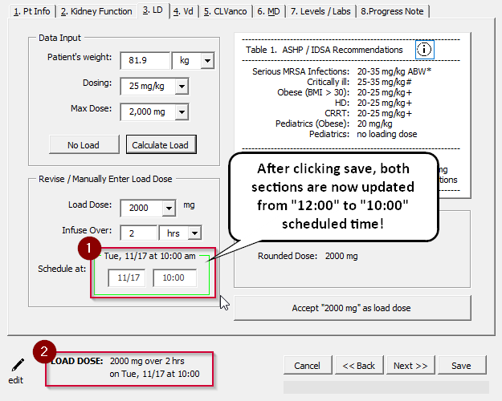

# 11/17 Follow-Up

## Updates

&#x2611; Removed UTI, Skin, Enterococcal, Staph Epi from `Exclusions` on `LandingPage`

&#x2611; Added 3rd dose option to `Labs/Levels` tab in `NewConsult`

&#x2611; Tried to fix bug when changing `Load Dose` or `Maintenance Dose`

-----------

###### Details and Screenshots of updates

#### 1.) &#x2611; Removed UTI, Skin, Enterococcal, Staph Epi from `Exclusions` on `LandingPage`

-------------------

> could remove the UTI, Skin, Enterococcal, Staph epi from the EXCLUSION main page since we are expanding access to all of those within the calculator?

**Before**: 

**After**:

#### 2.) &#x2611; Added 3rd dose option to `Labs/Levels` tab in `NewConsult`

--------------------

> Could you add the 3rd dose option below that Robin is talking about?

#### 3.) &#x2611; Tried to fix bug when changing `Load Dose` or `Maintenance Dose`

--------------------

