# 11/18 Follow-Up

## Updates

&#x2611; Removed UTI, Skin, Enterococcal, Staph Epi from `Exclusions` on `LandingPage`

&#x2611; Added 3rd dose option to `Labs/Levels` tab in `NewConsult`

&#x2611; Tried to fix bug when changing `Load Dose` or `Maintenance Dose`

&#x2611; Fixed a bug when trying to go straight to Post Levels and using a 1st dose strategy

-----------

- current calculator version ***1.14.1***

###### Details and Screenshots of updates

#### 1.) &#x2611; Removed UTI, Skin, Enterococcal, Staph Epi from `Exclusions` on `LandingPage`

-------------------

> could remove the UTI, Skin, Enterococcal, Staph epi from the EXCLUSION main page since we are expanding access to all of those within the calculator?

**Before**: 

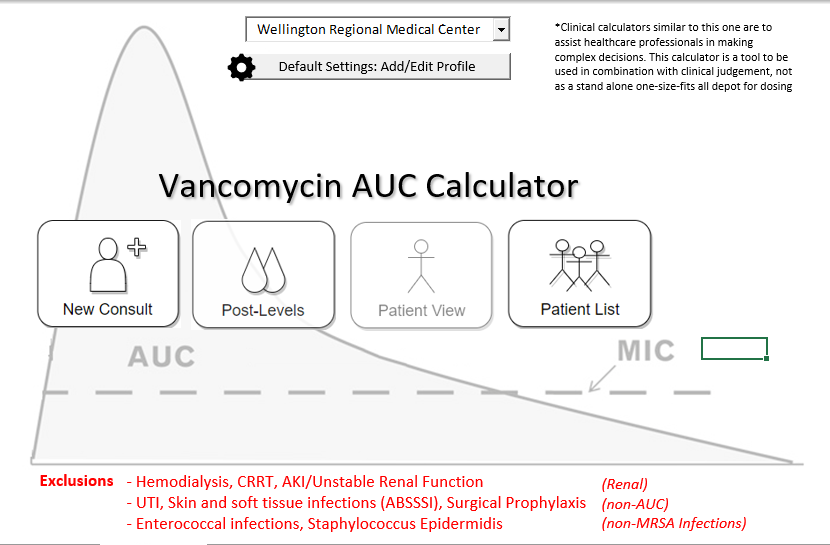

**After**:

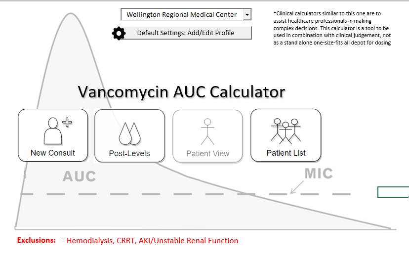

#### 2.) &#x2611; Added 3rd dose option to `Labs/Levels` tab in `NewConsult`

--------------------

> Could you add the 3rd dose option below that Robin is talking about?

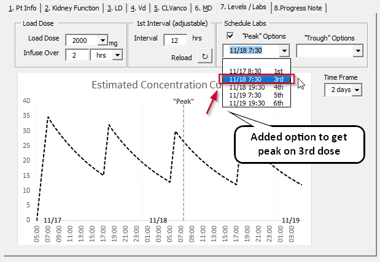

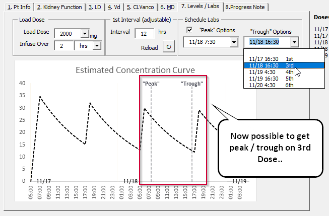

#### 3.) &#x2611; Tried to fix bug when changing `Load Dose` or `Maintenance Dose`

--------------------

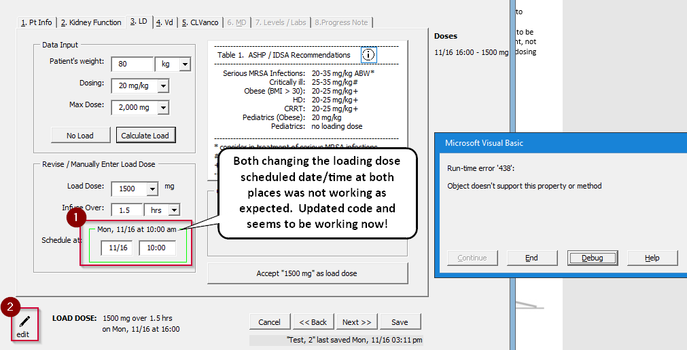

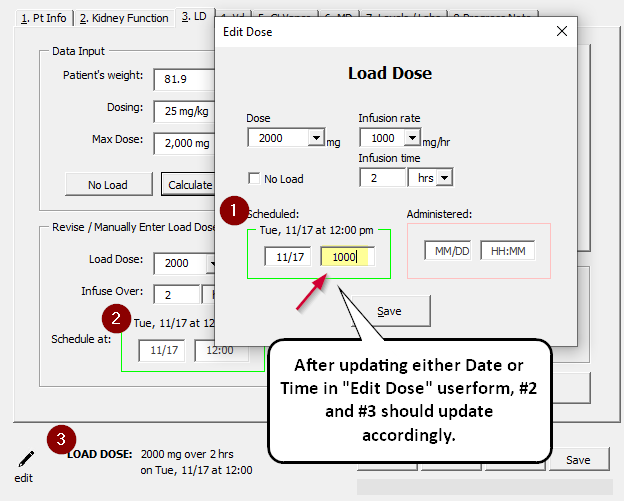

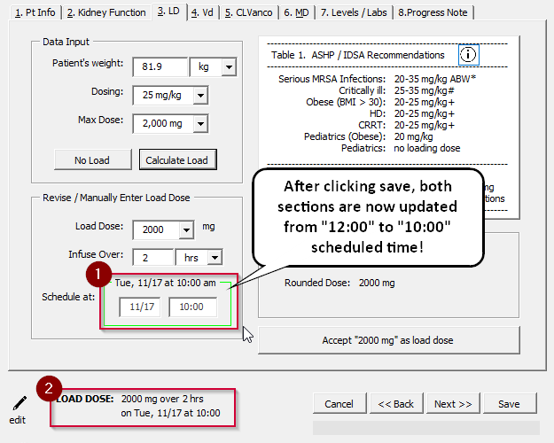

### 4.) &#x2611; Fixed a bug when trying to go straight to Post Levels and using a 1st dose strategy

> Hi Kurt!
>
> I was just talking with Robin on some issues that have come up in training staff and in converting some of our patients from existing trough based dosing.
>
> One thing I have been able to do on existing patients who are already at steady state and being converted to AUC (which is likely to only occur in the beginning of the conversion to AUC dosing), is to just enter the New patient data in the “post levels” portion and go from there. This appears to work for the SS patients as you enter a frequency (tau) when entering the SS levels and dose info.
> When I was talking to Robin, we were thinking about a scenario where an overnight RPh starts a patient and then a dosing RPh comes in the next day and wants to get a 1st dose level – I was thinking she would be able to use the same strategy and bypass the “consult” since the load and initial levels were already done. However, it looks like since we’re getting the error below, it’s requiring that initial frequency from the consult to calculate the TDD.

**Here was the bug that was screenshotted:**

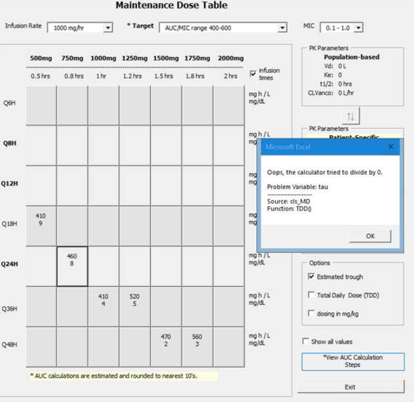

Recreated tried to fix the error when going straight to post levels, doing a 1st dose strategy.

When starting, here's an example Post Dose levels I inputted:
*1.) Ke / t1/2 tab*

\- **Level 1:** **34.8,** 11/17 09:30
\- **Level 2**: ***10.12\***, 11/17 17:30

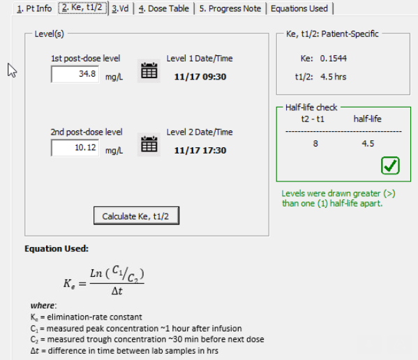

2.) Vd tab

\- **First Dose**: 2,000mg load dose over 2 hrs

\- **Date/Time**: 11/17 06:00

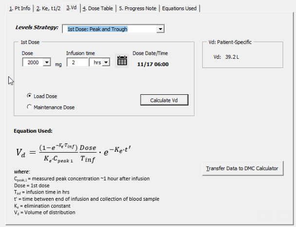

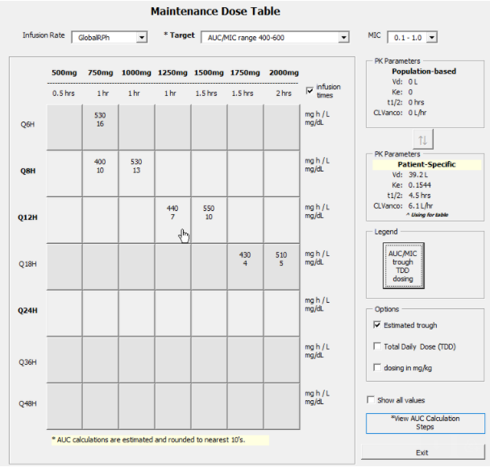

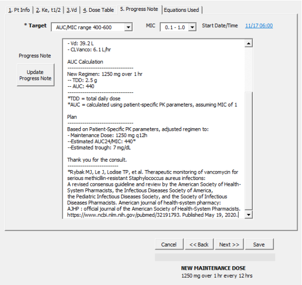