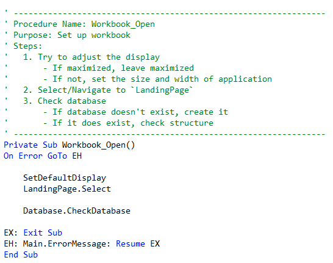
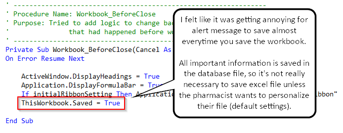
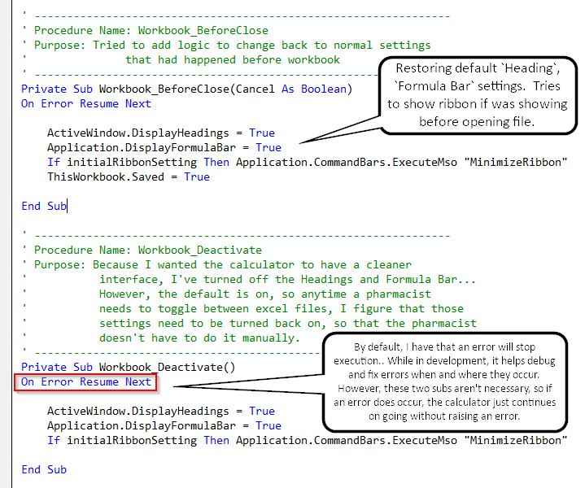
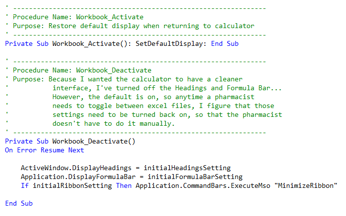

#  Follow-Up

## Next Steps

&#9744;  Keep duplicates from showing up in `cmbService` and `cmbConsultingPhysician` from SQL query string

`NewConsult`

&#9744; Progress note not displaying the right information about which peak or trough the pharmacist chose

&#9744; Add "Transfer to DMC Calculator" for `New Consult` userform **=/**

`PatientList`

☐ Day of therapy / Timeout to Patient List
☐ Add "Open in `NewConsult`/ `PostLevels`" functionality to `PatientList userframe`. 

* I've added the buttons, but have not connected them yet ...

User Guide 

☐ Edit guide to update information

---
## Completed

### Worked on `Workbook` events

* Tried to work on `Workbook` events so that the pharmacist has a better user experience when using the calculator.

&#x2611; Rewrote and documented `Workbook_Open` event

&#x2611; Suppressed `Save` notification when closing the workbook  

<blockquote> `Workbook_BeforeClose` and `Workbook_Deactivate` events </blockquote>

&#x2611; Updated `Workbook_BeforeClose` and `Workbook_Deactivate` events.  When testing, there were times where errors occurred that I didn't feel should interrupt workflow of calculator.

&#x2611; Updated `Workbook_Activate` and `Workbook_Deactivate` events

- Just really wanted to restore default view settings when leaving the calculator or toggling to another excel file.  When coming back to the calculator, restore the view for the calculator depending on if the application is in maximized or normal setting.

