## 7/8 Follow-up

> In working with the calculator update today and trying to put in some patients to try it out prior to the planned Go –Live, we’ve come up with a couple more questions.
> We have decided that we needed to clear these up on the call tomorrow prior to our official go live.
> I wanted to lay out our questions to help streamline the call and in case other sites have come across them as well:
 
### Question 1 - CrCl calculation
-----------
- updated calculation to default to IBW.  Yikes!
> 1)      Creatinine Clearance calculator – appears to be using TBW on all patients (rather than IBW) unless TBW >1.2 IBW
> 
> a.) **ABW 63.5kg, IBW 57kg**
>
> 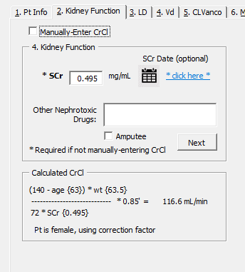

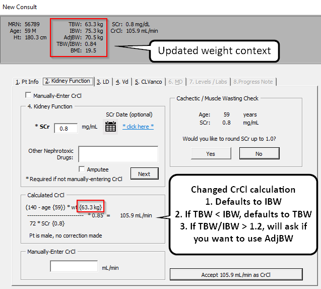

### Question 2 - Infusion Rate / Site / Pharmacist preferences
-----------
> 2)      Maintenance dose infusion rate is defaulting to GlobalRPh rate vs Cerner Infusion rate – can this be changed? We’re using the Cerner rates almost exclusively.

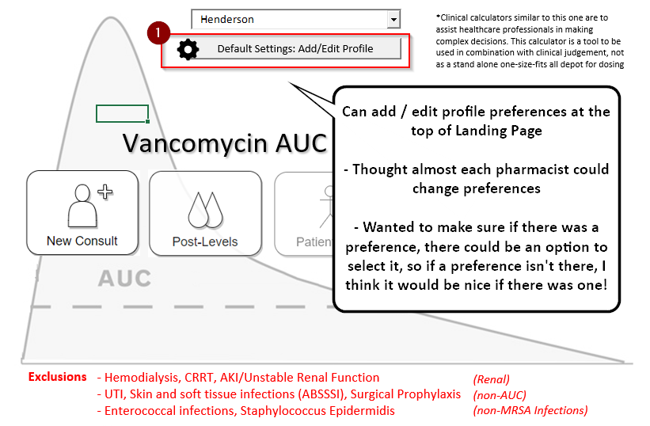

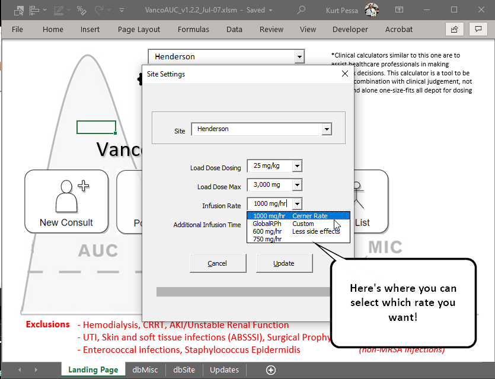

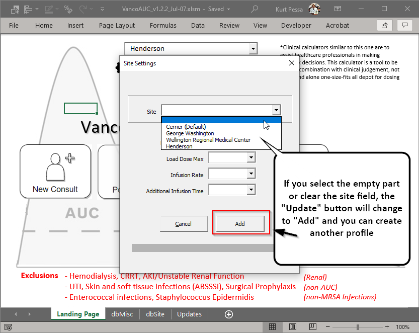

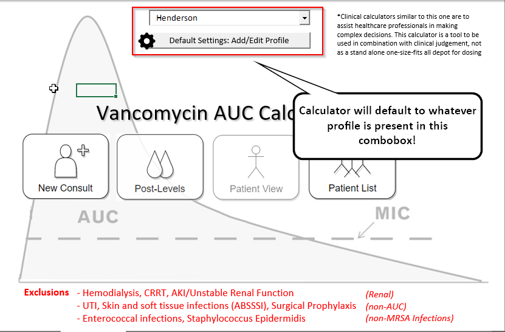

### Question 3 - Automatically populating CL equation
-----------
- tried to update, let me know if it's not working!

> 3)      CL equation – no longer populating automatically off TBW/IBW ration – was previously. Not a deal-breaker but was nice when it auto-populated

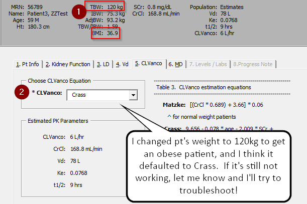

**Updated code (if it didn't include Matzke!):**

```Javascript
If NewConsult.MultiPage.value = pg5_CLVanco Then
    if pt.char.BMI >= 30 Then 
        NewConsult.cmbCLVanco = "Crass"
    else
        NewConsult.cmbCLVanco = "Matze"
    End if
End if
    
```
### Question 4 - Defaulting dose in PostLevels
- tried to fix logic!

> 4)      When processing post dose levels, if using levels after the loading dose, the “maintenance dose” defaults to the loading dose amount with maintenance dose frequency when adjusting the dose?

Tried to adjust the logic so that:
- if it's a `First Dose` peak and trough, then if there is a load dose, it goes for that before picking the maintenance dose.  
- if it's a `Steady-state` peak and trough, then it will go straight for the maintenance dose if possible.

**Here's the code when trying to prepopulate**

```Javascript
If PostLevels.cmbLevels = "First Dose: Peak and Trough" Then
    If pt.ld.givenQ Then
        If pt.ld.dose.strength <> 0 Then
            PostLevels.cmbDose = pt.ld.dose.strength
            PostLevels.tbTinf = pt.ld.dose.infusionTimeRounded
            PostLevels.cmbInfusionTimeUnits = "hrs"
            If CDbl(pt.ld.dose.administeredAt) > 0 Then
               PostLevels.lblDoseDateTime = Format(pt.ld.dose.administeredAt, "MM/DD HH:MM")
            End If
         End If
     Else
        If pt.md.dose.strength <> 0 Then
            PostLevels.cmbDose = pt.md.dose.strength
            PostLevels.tbTinf = pt.md.dose.infusionTimeRounded
            PostLevels.cmbInfusionTimeUnits = "hrs"
            If CDbl(pt.md.dose.administeredAt) > 0 Then
                PostLevels.lblDoseDateTime = Format(pt.md.dose.administeredAt, "MM/DD HH:MM")
            End If
        End If
    End If
ElseIf PostLevels.cmbLevels = "SS: Peak and Trough" Then
    If pt.md.dose.strength <> 0 Then
        PostLevels.cmbDose = pt.md.dose.strength
        PostLevels.tbTinf = pt.md.dose.infusionTimeRounded
        PostLevels.cmbInfusionTimeUnits = "hrs"
        If CDbl(pt.md.dose.administeredAt) > 0 Then
            PostLevels.lblDoseDateTime = Format(pt.md.dose.administeredAt, "MM/DD HH:MM")
        End If
    End If
End If
```


> a.       Unfortunately, I tried to recreate this but am now getting the actual maintenance doses (yay!)– not sure exactly what we did to populate the higher dose issue.

### Question 5 - Vd steady-state equation
- tried to update!  Let me know if it looks right!

> 5)      Steady state level issues: “t” not defined – per the equations at the end appears to be Tinf?
>
> 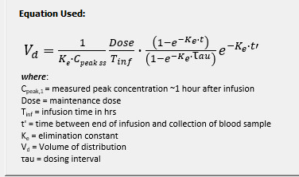


### Question - Patient #3
- The numbers look off!
> a. 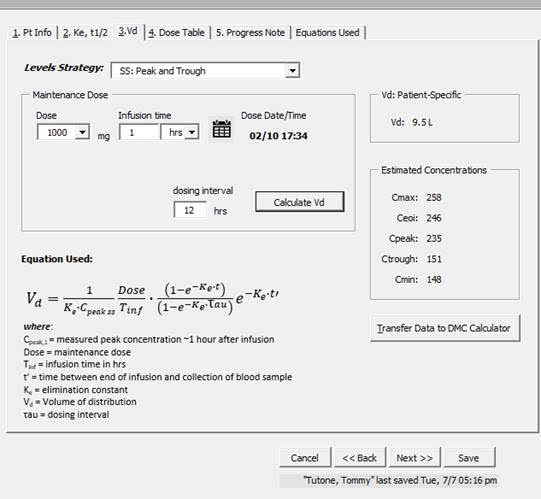

> b.       For patient 3 example – Vd populating as 9.5L – we are calculating ~88L??? Previous calculator gave 98.7L (6/24 version). Therefore calculated AUC based on this VD of 9.5L comes out to 4640 w/ trough of 151.  

Yeah, I feel like the numbers are off on this one! Good question.  I'm not sure if the example is good.  There had been a problem with the Vd calculation prior, but I think it's been fixed.  With the Detroit Medical Center calculator, you can transfer the data over to double-check value.
 
### Question 6 - Monitoring Form from Patient View
- Good point, I think this is on the Patient's page.  I haven't fixed this, but I'm intending to try to come up with a solution
> 6)      Creating the monitoring form – no patients are populating in the dropdown to select and create a form?

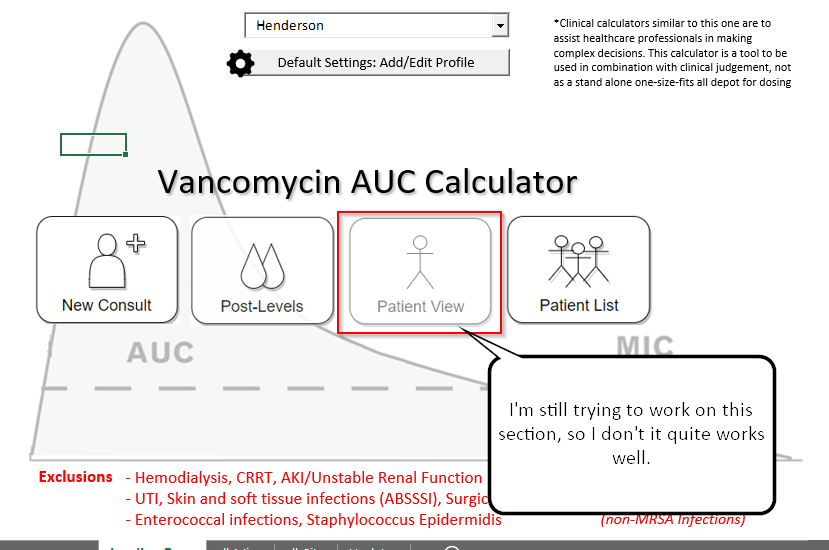


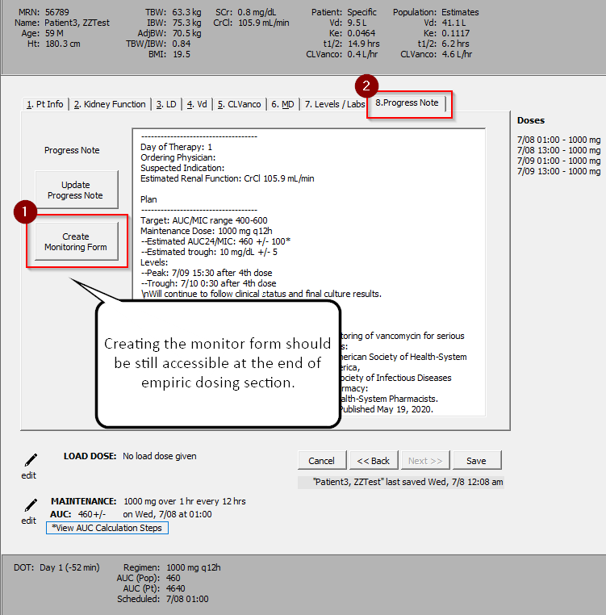

### Question 7 - AUC Calculation Steps - Too large for screen!
- Tried to fix, tried to add scroll bar and make image smaller
> 7)      When clicking on “View AUC Calculation Steps” the screen that populates doesn’t show all of the equations and we’re unable to scroll or scale it down.

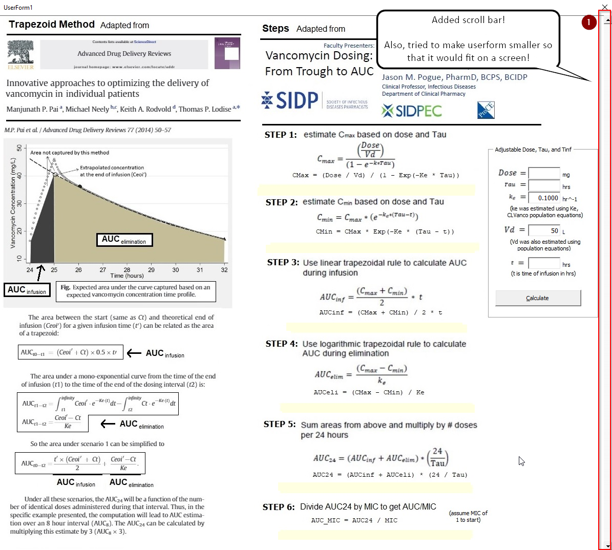

### Question 8 - Multi-tasking with other excel files while using AUC Calculator

> 8)      Unable to use our existing Excel sheet at the same time as the calculator – forces shut down of Calculator – any workaround to this?

- Good question.  The windows are excel `userform`s .. and can take precedence until you unload the userform.  I wonder if you could `ALT+TAB` while using the calculator to the other sheet?  Not sure what a good answer would be.

### Question 9 - DMC Calculator not linked
> 9)      DMC calculator not linked, is this on a Sharepoint? (also how do we access the Sharepoint?)

I'll attach the Detroit Medical Calculator to the e-mail.  I don't think I'm able to transfer the data to the Detroit Medical calculator unless it is already downloaded and in the same directory/folder. I guess I could try to find and add a link to the file!

> Sorry for so many issues! Hopefully we can sort them all out on the call J

Thanks for all the questions! I'm hoping that it helps and not hurts the processes already in place!

Regards,
Kurt
